> [!NOTE]
> Dette er en uferdig "proof of concept" (i skrivende stund desember 2024).

# Autogenerer graph for trafikken på toi-rapiden
Denne naisjobben kjører hver natt og logger en mermaid-graph som viser hvordan applikasjonene på rapiden prater sammen.
Logglinjen kan manuelt limes inn i denne readme-filen for å få en oversikt over rapid-arkitekturen.

Oppdatert 2023-05-25
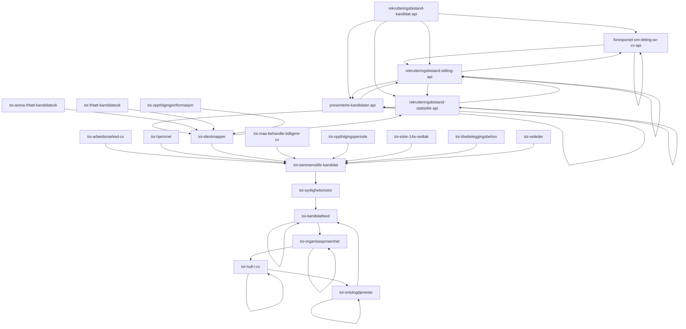
<details><summary>arbeidsgiversKandidatliste.VisningKontaktinfo</summary>

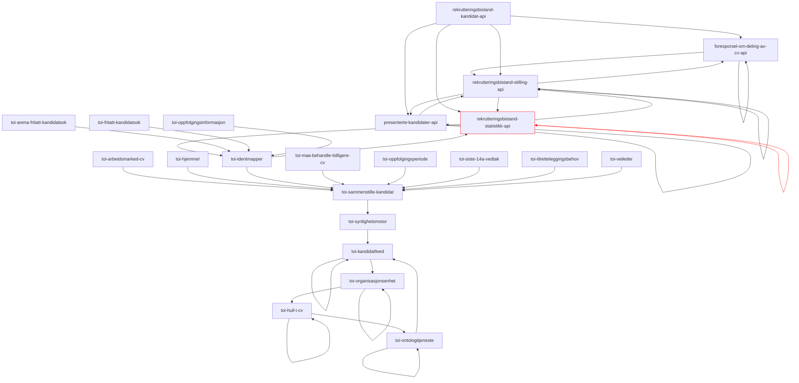

</details>
<details><summary>arbeidsmarked-cv</summary>

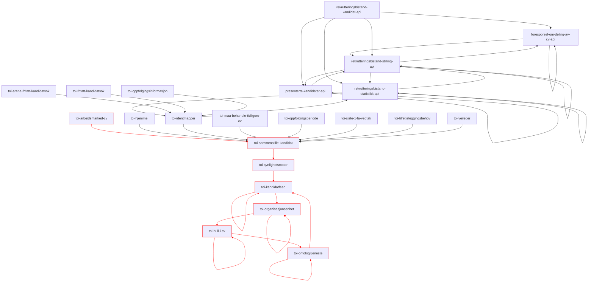

</details>
<details><summary>arena-fritatt-kandidatsøk</summary>

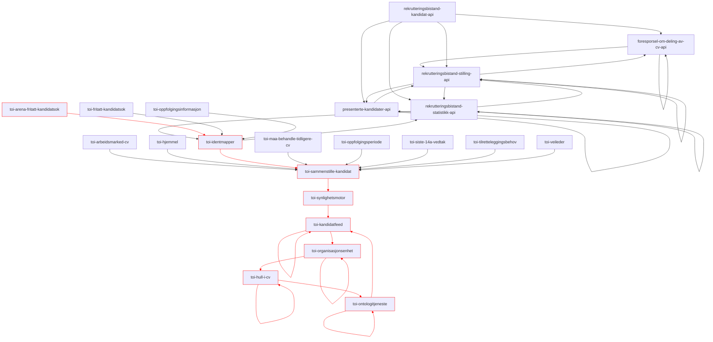

</details>
<details><summary>fritatt-kandidatsøk</summary>


</details>
<details><summary>fritattFraArena</summary>

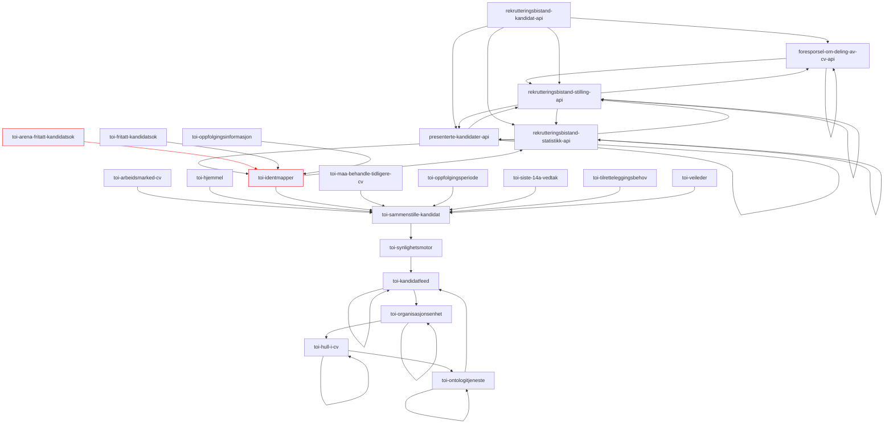

</details>
<details><summary>hjemmel</summary>


</details>
<details><summary>kandidat_v2.DelCvMedArbeidsgiver</summary>

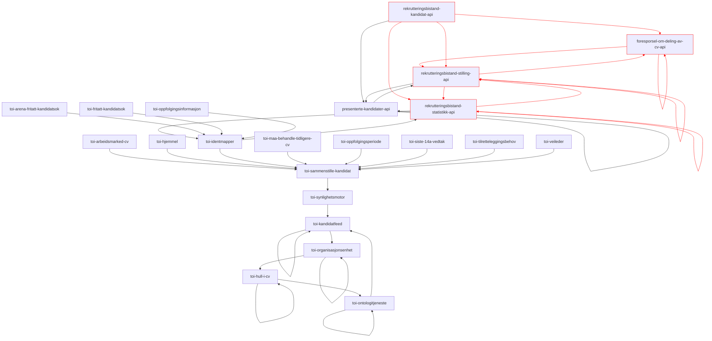

</details>
<details><summary>kandidat_v2.FjernetRegistreringFåttJobben</summary>

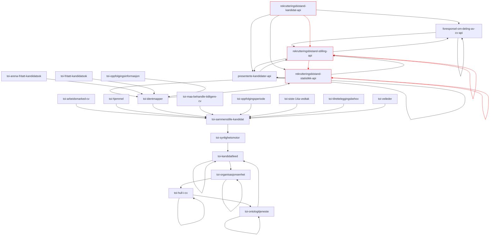

</details>
<details><summary>kandidat_v2.LukketKandidatliste</summary>

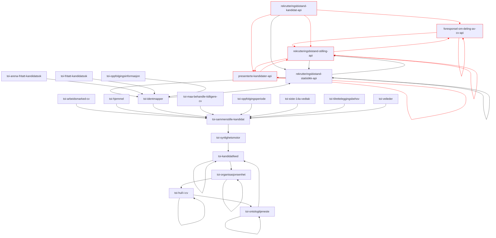

</details>
<details><summary>kandidat_v2.OppdaterteKandidatliste</summary>


</details>
<details><summary>kandidat_v2.OpprettetKandidatliste</summary>

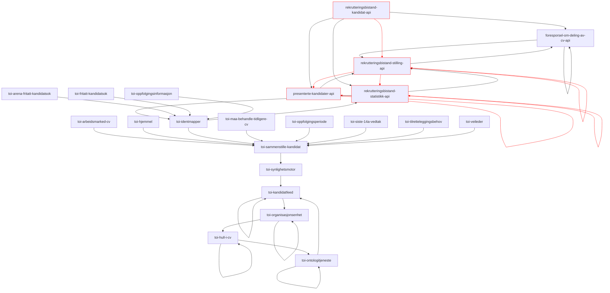

</details>
<details><summary>kandidat_v2.RegistrertDeltCv</summary>


</details>
<details><summary>kandidat_v2.RegistrertFåttJobben</summary>

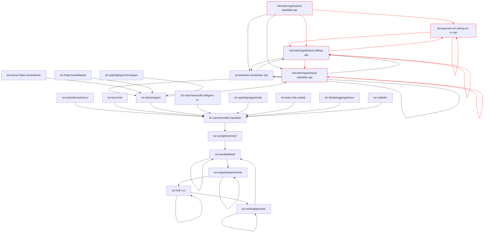

</details>
<details><summary>kandidat_v2.SlettetStillingOgKandidatliste</summary>


</details>
<details><summary>må-behandle-tidligere-cv</summary>


</details>
<details><summary>notifikasjon.cv-delt</summary>

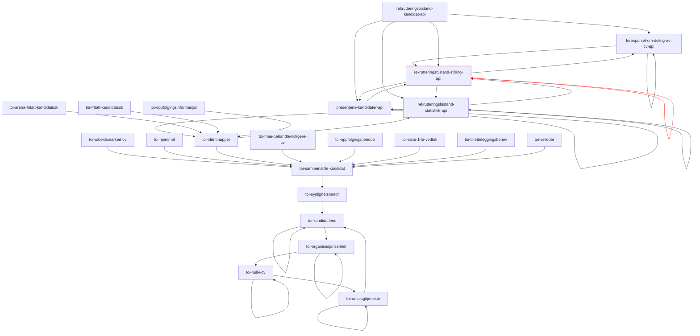

</details>
<details><summary>oppfølgingsinformasjon</summary>

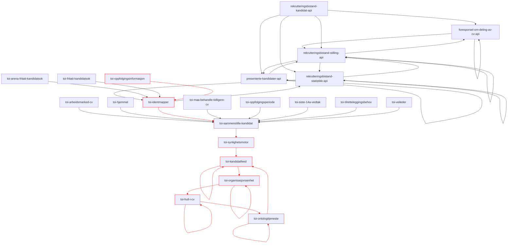

</details>
<details><summary>oppfølgingsperiode</summary>

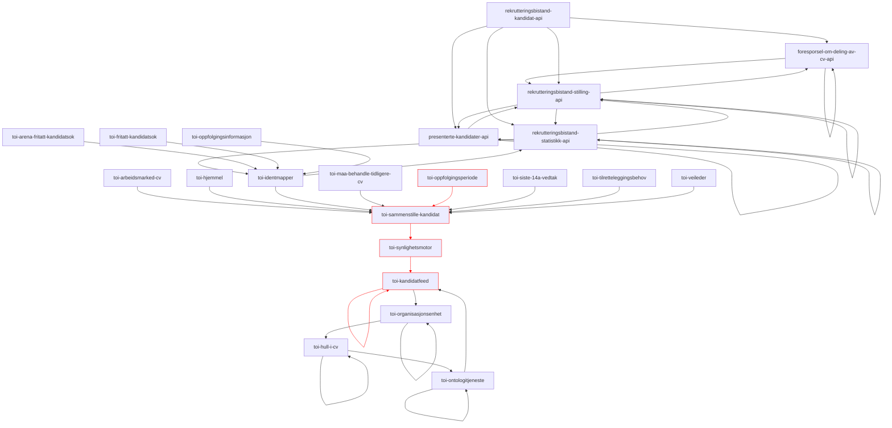

</details>
<details><summary>republisert</summary>

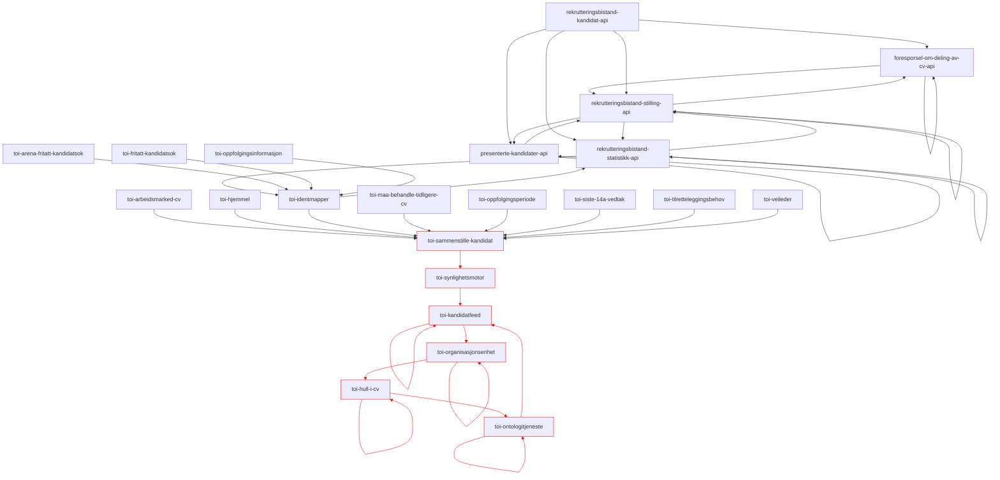

</details>
<details><summary>siste14avedtak</summary>

```mermaid
graph TD;
foresporsel-om-deling-av-cv-api --> foresporsel-om-deling-av-cv-api;
foresporsel-om-deling-av-cv-api --> rekrutteringsbistand-stilling-api;
presenterte-kandidater-api --> presenterte-kandidater-api;
presenterte-kandidater-api --> rekrutteringsbistand-stilling-api;
rekrutteringsbistand-kandidat-api --> foresporsel-om-deling-av-cv-api;
rekrutteringsbistand-kandidat-api --> presenterte-kandidater-api;
rekrutteringsbistand-kandidat-api --> rekrutteringsbistand-statistikk-api;
rekrutteringsbistand-kandidat-api --> rekrutteringsbistand-stilling-api;
rekrutteringsbistand-statistikk-api --> rekrutteringsbistand-statistikk-api;
rekrutteringsbistand-statistikk-api --> rekrutteringsbistand-stilling-api;
rekrutteringsbistand-statistikk-api --> toi-identmapper;
rekrutteringsbistand-stilling-api --> foresporsel-om-deling-av-cv-api;
rekrutteringsbistand-stilling-api --> presenterte-kandidater-api;
rekrutteringsbistand-stilling-api --> rekrutteringsbistand-statistikk-api;
rekrutteringsbistand-stilling-api --> rekrutteringsbistand-stilling-api;
toi-arbeidsmarked-cv --> toi-sammenstille-kandidat;
toi-arena-fritatt-kandidatsok --> toi-identmapper;
toi-fritatt-kandidatsok --> toi-identmapper;
toi-hjemmel --> toi-sammenstille-kandidat;
toi-hull-i-cv:::x --> toi-hull-i-cv:::x;
toi-hull-i-cv:::x --> toi-ontologitjeneste:::x;
toi-identmapper --> rekrutteringsbistand-statistikk-api;
toi-identmapper --> toi-sammenstille-kandidat;
toi-kandidatfeed:::x --> toi-kandidatfeed:::x;
toi-kandidatfeed:::x --> toi-organisasjonsenhet:::x;
toi-maa-behandle-tidligere-cv --> toi-sammenstille-kandidat;
toi-ontologitjeneste:::x --> toi-kandidatfeed:::x;
toi-ontologitjeneste:::x --> toi-ontologitjeneste:::x;
toi-oppfolgingsinformasjon --> toi-identmapper;
toi-oppfolgingsperiode --> toi-sammenstille-kandidat;
toi-organisasjonsenhet:::x --> toi-hull-i-cv:::x;
toi-organisasjonsenhet:::x --> toi-organisasjonsenhet:::x;
toi-sammenstille-kandidat:::x --> toi-synlighetsmotor:::x;
toi-siste-14a-vedtak:::x --> toi-sammenstille-kandidat:::x;
toi-synlighetsmotor:::x --> toi-kandidatfeed:::x;
toi-tilretteleggingsbehov --> toi-sammenstille-kandidat;
toi-veileder --> toi-sammenstille-kandidat;

linkStyle 19,20,23,24,26,27,30,31,32,33,34 stroke:red;
classDef x stroke: red;
```

</details>
<details><summary>tilretteleggingsbehov</summary>

```mermaid
graph TD;
foresporsel-om-deling-av-cv-api --> foresporsel-om-deling-av-cv-api;
foresporsel-om-deling-av-cv-api --> rekrutteringsbistand-stilling-api;
presenterte-kandidater-api --> presenterte-kandidater-api;
presenterte-kandidater-api --> rekrutteringsbistand-stilling-api;
rekrutteringsbistand-kandidat-api --> foresporsel-om-deling-av-cv-api;
rekrutteringsbistand-kandidat-api --> presenterte-kandidater-api;
rekrutteringsbistand-kandidat-api --> rekrutteringsbistand-statistikk-api;
rekrutteringsbistand-kandidat-api --> rekrutteringsbistand-stilling-api;
rekrutteringsbistand-statistikk-api --> rekrutteringsbistand-statistikk-api;
rekrutteringsbistand-statistikk-api --> rekrutteringsbistand-stilling-api;
rekrutteringsbistand-statistikk-api --> toi-identmapper;
rekrutteringsbistand-stilling-api --> foresporsel-om-deling-av-cv-api;
rekrutteringsbistand-stilling-api --> presenterte-kandidater-api;
rekrutteringsbistand-stilling-api --> rekrutteringsbistand-statistikk-api;
rekrutteringsbistand-stilling-api --> rekrutteringsbistand-stilling-api;
toi-arbeidsmarked-cv --> toi-sammenstille-kandidat;
toi-arena-fritatt-kandidatsok --> toi-identmapper;
toi-fritatt-kandidatsok --> toi-identmapper;
toi-hjemmel --> toi-sammenstille-kandidat;
toi-hull-i-cv:::x --> toi-hull-i-cv:::x;
toi-hull-i-cv:::x --> toi-ontologitjeneste:::x;
toi-identmapper --> rekrutteringsbistand-statistikk-api;
toi-identmapper --> toi-sammenstille-kandidat;
toi-kandidatfeed:::x --> toi-kandidatfeed:::x;
toi-kandidatfeed:::x --> toi-organisasjonsenhet:::x;
toi-maa-behandle-tidligere-cv --> toi-sammenstille-kandidat;
toi-ontologitjeneste:::x --> toi-kandidatfeed:::x;
toi-ontologitjeneste:::x --> toi-ontologitjeneste:::x;
toi-oppfolgingsinformasjon --> toi-identmapper;
toi-oppfolgingsperiode --> toi-sammenstille-kandidat;
toi-organisasjonsenhet:::x --> toi-hull-i-cv:::x;
toi-organisasjonsenhet:::x --> toi-organisasjonsenhet:::x;
toi-sammenstille-kandidat:::x --> toi-synlighetsmotor:::x;
toi-siste-14a-vedtak --> toi-sammenstille-kandidat;
toi-synlighetsmotor:::x --> toi-kandidatfeed:::x;
toi-tilretteleggingsbehov:::x --> toi-sammenstille-kandidat:::x;
toi-veileder --> toi-sammenstille-kandidat;

linkStyle 19,20,23,24,26,27,30,31,32,34,35 stroke:red;
classDef x stroke: red;
```

</details>
<details><summary>tiltakAvtaleInngått</summary>

```mermaid
graph TD;
foresporsel-om-deling-av-cv-api --> foresporsel-om-deling-av-cv-api;
foresporsel-om-deling-av-cv-api --> rekrutteringsbistand-stilling-api;
presenterte-kandidater-api --> presenterte-kandidater-api;
presenterte-kandidater-api --> rekrutteringsbistand-stilling-api;
rekrutteringsbistand-kandidat-api --> foresporsel-om-deling-av-cv-api;
rekrutteringsbistand-kandidat-api --> presenterte-kandidater-api;
rekrutteringsbistand-kandidat-api --> rekrutteringsbistand-statistikk-api;
rekrutteringsbistand-kandidat-api --> rekrutteringsbistand-stilling-api;
rekrutteringsbistand-statistikk-api:::x --> rekrutteringsbistand-statistikk-api:::x;
rekrutteringsbistand-statistikk-api --> rekrutteringsbistand-stilling-api;
rekrutteringsbistand-statistikk-api:::x --> toi-identmapper:::x;
rekrutteringsbistand-stilling-api --> foresporsel-om-deling-av-cv-api;
rekrutteringsbistand-stilling-api --> presenterte-kandidater-api;
rekrutteringsbistand-stilling-api --> rekrutteringsbistand-statistikk-api;
rekrutteringsbistand-stilling-api --> rekrutteringsbistand-stilling-api;
toi-arbeidsmarked-cv --> toi-sammenstille-kandidat;
toi-arena-fritatt-kandidatsok --> toi-identmapper;
toi-fritatt-kandidatsok --> toi-identmapper;
toi-hjemmel --> toi-sammenstille-kandidat;
toi-hull-i-cv --> toi-hull-i-cv;
toi-hull-i-cv --> toi-ontologitjeneste;
toi-identmapper:::x --> rekrutteringsbistand-statistikk-api:::x;
toi-identmapper --> toi-sammenstille-kandidat;
toi-kandidatfeed --> toi-kandidatfeed;
toi-kandidatfeed --> toi-organisasjonsenhet;
toi-maa-behandle-tidligere-cv --> toi-sammenstille-kandidat;
toi-ontologitjeneste --> toi-kandidatfeed;
toi-ontologitjeneste --> toi-ontologitjeneste;
toi-oppfolgingsinformasjon --> toi-identmapper;
toi-oppfolgingsperiode --> toi-sammenstille-kandidat;
toi-organisasjonsenhet --> toi-hull-i-cv;
toi-organisasjonsenhet --> toi-organisasjonsenhet;
toi-sammenstille-kandidat --> toi-synlighetsmotor;
toi-siste-14a-vedtak --> toi-sammenstille-kandidat;
toi-synlighetsmotor --> toi-kandidatfeed;
toi-tilretteleggingsbehov --> toi-sammenstille-kandidat;
toi-veileder --> toi-sammenstille-kandidat;

linkStyle 8,10,21 stroke:red;
classDef x stroke: red;
```

</details>
<details><summary>veileder</summary>

```mermaid
graph TD;
foresporsel-om-deling-av-cv-api --> foresporsel-om-deling-av-cv-api;
foresporsel-om-deling-av-cv-api --> rekrutteringsbistand-stilling-api;
presenterte-kandidater-api --> presenterte-kandidater-api;
presenterte-kandidater-api --> rekrutteringsbistand-stilling-api;
rekrutteringsbistand-kandidat-api --> foresporsel-om-deling-av-cv-api;
rekrutteringsbistand-kandidat-api --> presenterte-kandidater-api;
rekrutteringsbistand-kandidat-api --> rekrutteringsbistand-statistikk-api;
rekrutteringsbistand-kandidat-api --> rekrutteringsbistand-stilling-api;
rekrutteringsbistand-statistikk-api --> rekrutteringsbistand-statistikk-api;
rekrutteringsbistand-statistikk-api --> rekrutteringsbistand-stilling-api;
rekrutteringsbistand-statistikk-api --> toi-identmapper;
rekrutteringsbistand-stilling-api --> foresporsel-om-deling-av-cv-api;
rekrutteringsbistand-stilling-api --> presenterte-kandidater-api;
rekrutteringsbistand-stilling-api --> rekrutteringsbistand-statistikk-api;
rekrutteringsbistand-stilling-api --> rekrutteringsbistand-stilling-api;
toi-arbeidsmarked-cv --> toi-sammenstille-kandidat;
toi-arena-fritatt-kandidatsok --> toi-identmapper;
toi-fritatt-kandidatsok --> toi-identmapper;
toi-hjemmel --> toi-sammenstille-kandidat;
toi-hull-i-cv:::x --> toi-hull-i-cv:::x;
toi-hull-i-cv:::x --> toi-ontologitjeneste:::x;
toi-identmapper --> rekrutteringsbistand-statistikk-api;
toi-identmapper --> toi-sammenstille-kandidat;
toi-kandidatfeed:::x --> toi-kandidatfeed:::x;
toi-kandidatfeed:::x --> toi-organisasjonsenhet:::x;
toi-maa-behandle-tidligere-cv --> toi-sammenstille-kandidat;
toi-ontologitjeneste:::x --> toi-kandidatfeed:::x;
toi-ontologitjeneste:::x --> toi-ontologitjeneste:::x;
toi-oppfolgingsinformasjon --> toi-identmapper;
toi-oppfolgingsperiode --> toi-sammenstille-kandidat;
toi-organisasjonsenhet:::x --> toi-hull-i-cv:::x;
toi-organisasjonsenhet:::x --> toi-organisasjonsenhet:::x;
toi-sammenstille-kandidat:::x --> toi-synlighetsmotor:::x;
toi-siste-14a-vedtak --> toi-sammenstille-kandidat;
toi-synlighetsmotor:::x --> toi-kandidatfeed:::x;
toi-tilretteleggingsbehov --> toi-sammenstille-kandidat;
toi-veileder:::x --> toi-sammenstille-kandidat:::x;

linkStyle 19,20,23,24,26,27,30,31,32,34,36 stroke:red;
classDef x stroke: red;
```

</details>


# Definisjoner 

## RapidService
En applikasjon som leser/skriver eventer på rapid

## Graph
Noder og kanter som viser en oversikt over eventer mellom applikasjoner

### Node
Node-representasjon av en rapid-service. 
#### Edge
Edge-representasjon av event som går mellom to rapid-servicer
Retning på pilen viser hvilken vei eventen flyter igjennom applikasjonene

## Event
Melding på rapid. Denne opprettes i en applikasjon og "flyter" fra rapid-service til rapid-service, som populerer denne.

## MermaidGraph
Visualisering av mermaid-grafer basert på tekstedefinisjoner som kan tolkes i markup

### MermaidTextDefinition
En linje i MermaidGraph


# Troubleshooting

## Slutt-applikasjonen for en hendelse får ikke en pil pekende på en selv
For at grapheren skal plukke opp den siste applikasjonen som konsumerer en event, så må den siste applikasjonen republisere hendelsen. 
For å unngå en evig loop ved en slik republisering kan man sette et felt til true, og sjekker at dette feltet ikke er satt ved konsumering ( rejectValue("@slutt_av_hendelseskjede", true) )


# Henvendelser

## For Nav-ansatte
* Dette Git-repositoriet eies av [team Toi](https://teamkatalog.nav.no/team/76f378c5-eb35-42db-9f4d-0e8197be0131).
* Slack: [#arbeidsgiver-toi-dev](https://nav-it.slack.com/archives/C02HTU8DBSR)

## For folk utenfor Nav
* IT-avdelingen i [Arbeids- og velferdsdirektoratet](https://www.nav.no/no/NAV+og+samfunn/Kontakt+NAV/Relatert+informasjon/arbeids-og-velferdsdirektoratet-kontorinformasjon)
