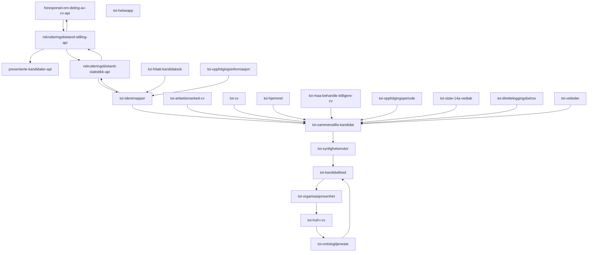

# Autogenerer graph over trafikken på toi-rapiden
Denne applikasjonen kjører hver midnatt og logger en mermaid-graf som viser hvordan applikasjonene på rapiden prater sammen:

Oppdatert 2023-01-12

