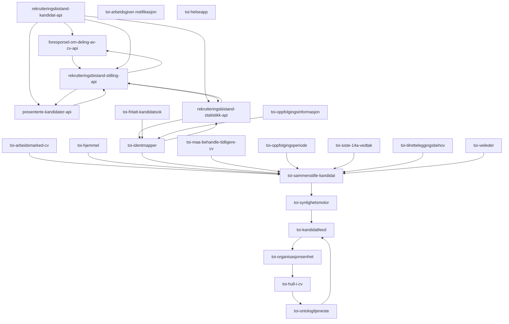

# Autogenerer graph for trafikken på toi-rapiden
Denne applikasjonen kjører hver midnatt og logger en mermaid-graph som viser hvordan applikasjonene på rapiden prater sammen:

Oppdatert 2023-03-14

# Definisjoner 

## RapidService
En applikasjon som leser/skriver hendelser på rapid

## Graph
Noder og kanter som viser en oversikt over eventer mellom applikasjoner

### Node
Node-representasjon av en rapid-service. 
#### Edge
Edge-representasjon av koblingen mellom rapid-servicer.
Brukes inne i node for å vise hva som er neste node den peker på.
##### ExistingEdge
Edge-representasjon av en hendelseskjede-element mellom to rapid-servicer
##### NoEdges
Edge-representasjon av en manglende kobling fra en node

## Hendelse
### EventName
### UgyldigHendelse
### GyldigHendelse

## Mermaid
### MermaidGraph
### MermaidInstruction
### MermaidGraphPerEvent

