# Autogenerer graph for trafikken på toi-rapiden
Denne applikasjonen kjører hver midnatt og logger en mermaid-graph som viser hvordan applikasjonene på rapiden prater sammen:

Oppdatert 2023-03-23
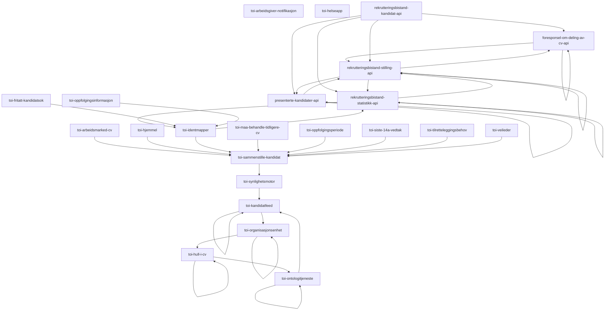
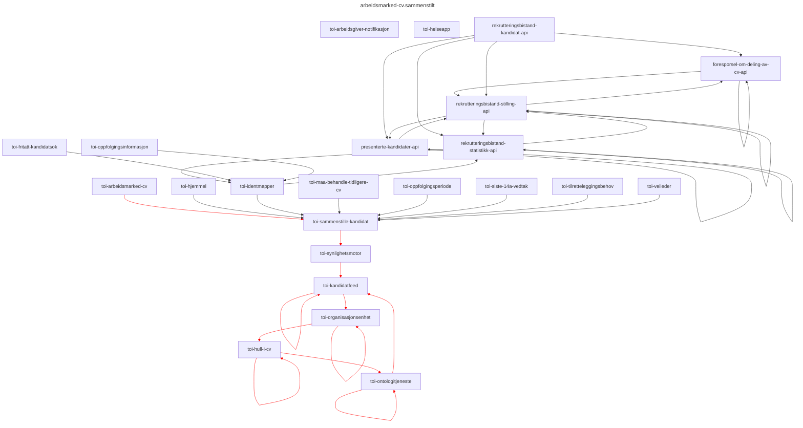
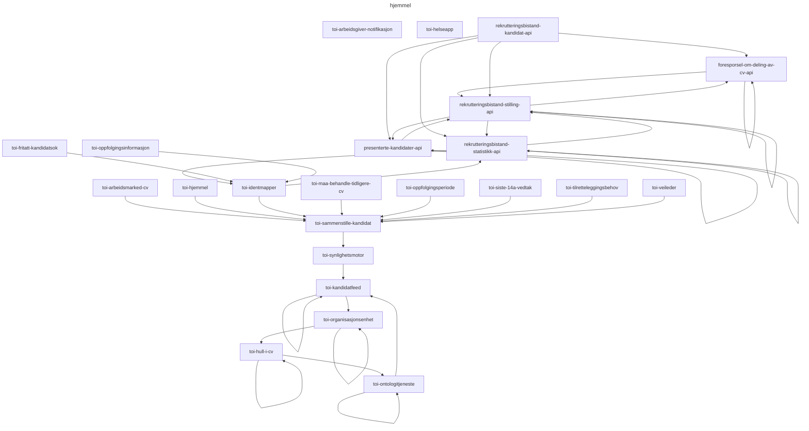


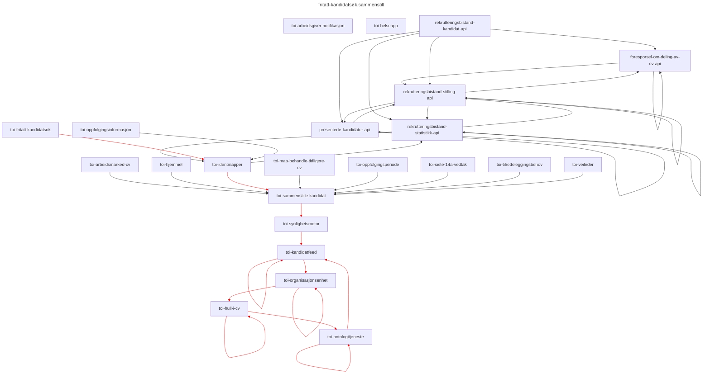


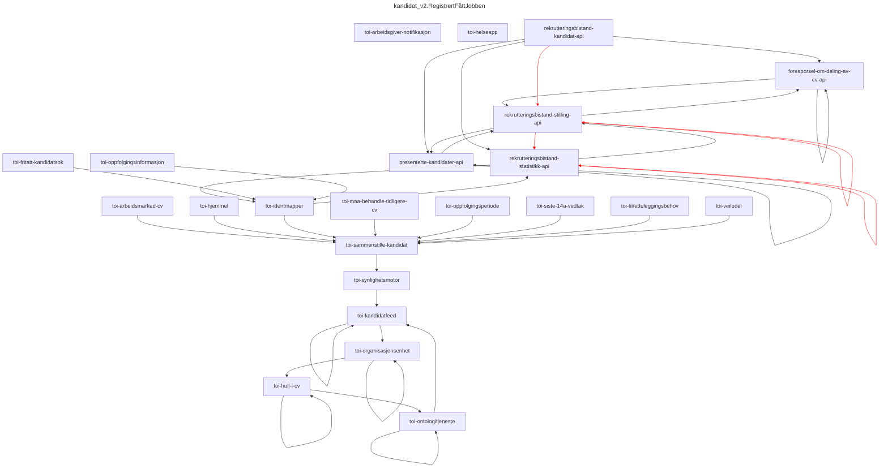
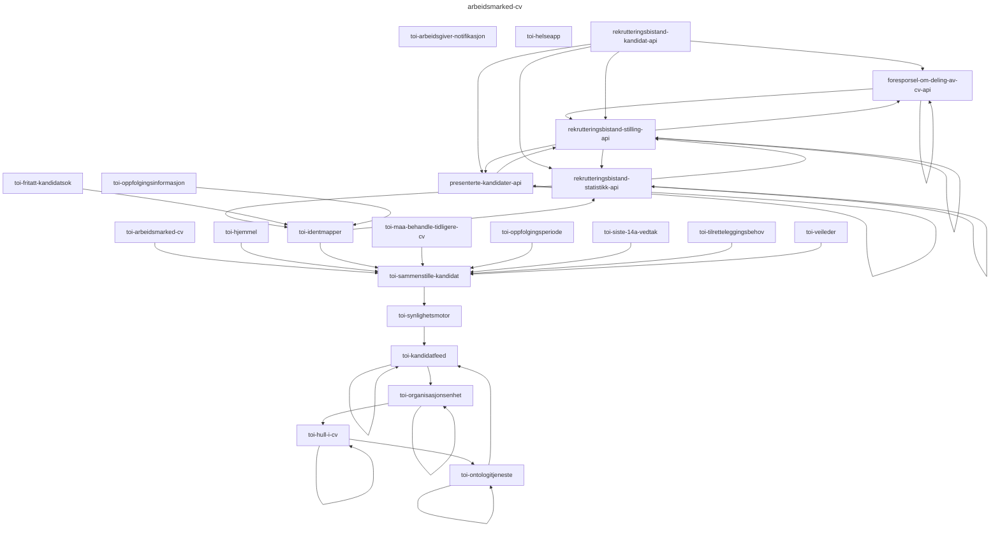


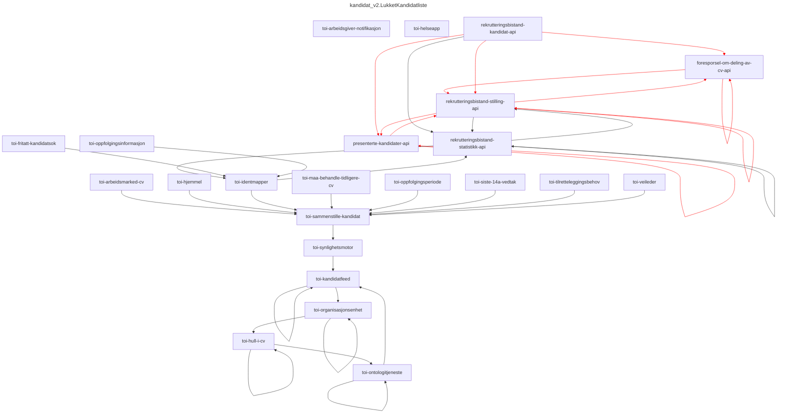
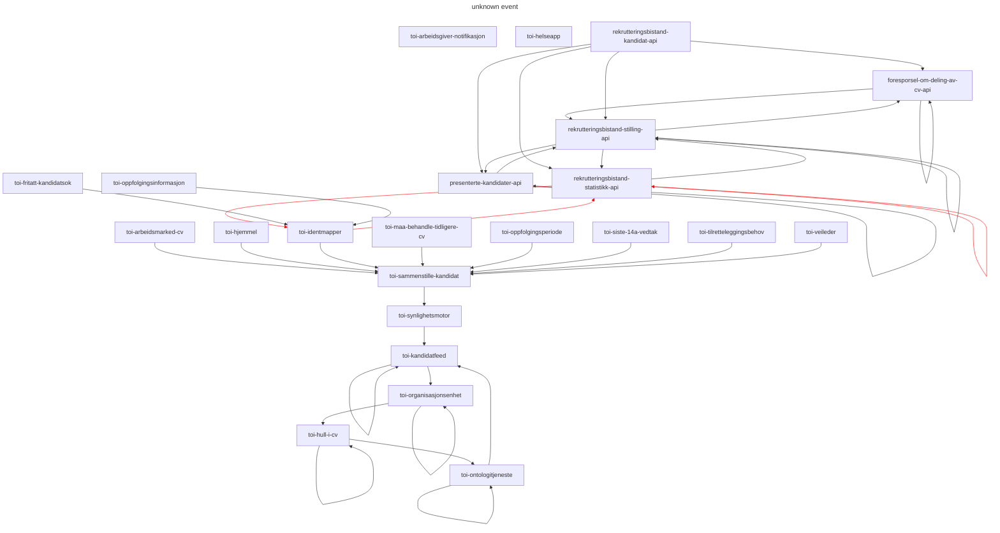

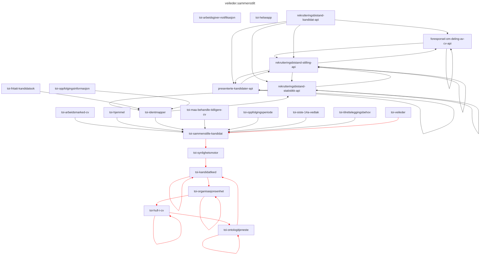
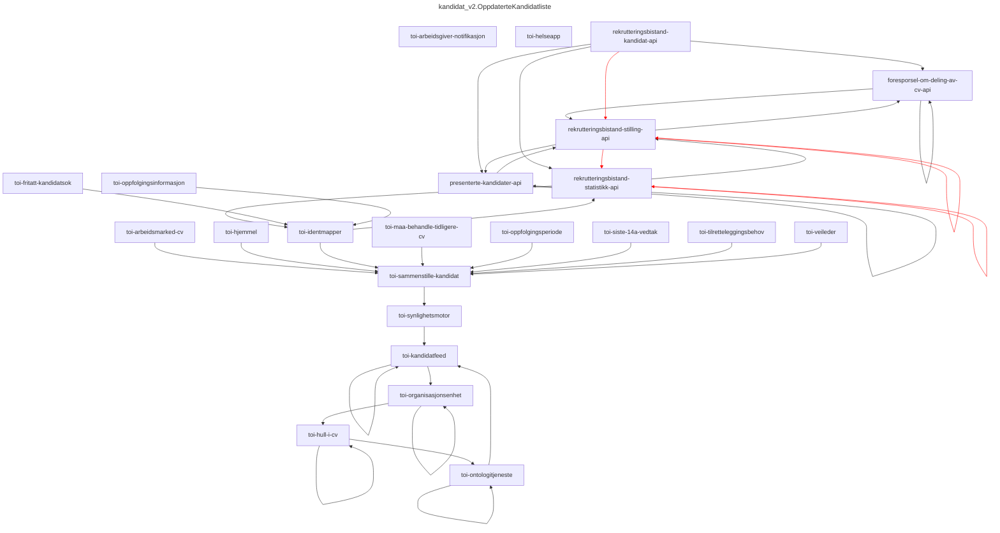
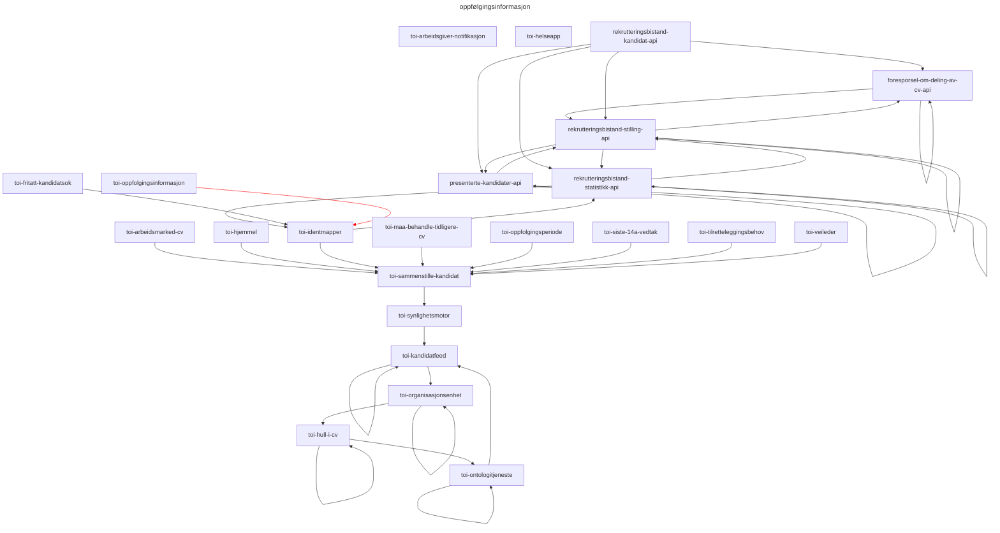
```mermaid
---
title: oppfølgingsinformasjon.sammenstilt
---
graph TD;
toi-arbeidsgiver-notifikasjon;
toi-helseapp;
foresporsel-om-deling-av-cv-api --> foresporsel-om-deling-av-cv-api;
foresporsel-om-deling-av-cv-api --> rekrutteringsbistand-stilling-api;
presenterte-kandidater-api --> presenterte-kandidater-api;
presenterte-kandidater-api --> rekrutteringsbistand-stilling-api;
rekrutteringsbistand-kandidat-api --> foresporsel-om-deling-av-cv-api;
rekrutteringsbistand-kandidat-api --> presenterte-kandidater-api;
rekrutteringsbistand-kandidat-api --> rekrutteringsbistand-statistikk-api;
rekrutteringsbistand-kandidat-api --> rekrutteringsbistand-stilling-api;
rekrutteringsbistand-statistikk-api --> rekrutteringsbistand-statistikk-api;
rekrutteringsbistand-statistikk-api --> rekrutteringsbistand-stilling-api;
rekrutteringsbistand-statistikk-api --> toi-identmapper;
rekrutteringsbistand-stilling-api --> foresporsel-om-deling-av-cv-api;
rekrutteringsbistand-stilling-api --> presenterte-kandidater-api;
rekrutteringsbistand-stilling-api --> rekrutteringsbistand-statistikk-api;
rekrutteringsbistand-stilling-api --> rekrutteringsbistand-stilling-api;
toi-arbeidsmarked-cv --> toi-sammenstille-kandidat;
toi-fritatt-kandidatsok --> toi-identmapper;
toi-hjemmel --> toi-sammenstille-kandidat;
toi-hull-i-cv --> toi-hull-i-cv;
toi-hull-i-cv --> toi-ontologitjeneste;
toi-identmapper --> rekrutteringsbistand-statistikk-api;
toi-identmapper --> toi-sammenstille-kandidat;
toi-kandidatfeed --> toi-kandidatfeed;
toi-kandidatfeed --> toi-organisasjonsenhet;
toi-maa-behandle-tidligere-cv --> toi-sammenstille-kandidat;
toi-ontologitjeneste --> toi-kandidatfeed;
toi-ontologitjeneste --> toi-ontologitjeneste;
toi-oppfolgingsinformasjon --> toi-identmapper;
toi-oppfolgingsperiode --> toi-sammenstille-kandidat;
toi-organisasjonsenhet --> toi-hull-i-cv;
toi-organisasjonsenhet --> toi-organisasjonsenhet;
toi-sammenstille-kandidat --> toi-synlighetsmotor;
toi-siste-14a-vedtak --> toi-sammenstille-kandidat;
toi-synlighetsmotor --> toi-kandidatfeed;
toi-tilretteleggingsbehov --> toi-sammenstille-kandidat;
toi-veileder --> toi-sammenstille-kandidat;

linkStyle 18 stroke:red;
linkStyle 19 stroke:red;
linkStyle 21 stroke:red;
linkStyle 22 stroke:red;
linkStyle 23 stroke:red;
linkStyle 25 stroke:red;
linkStyle 26 stroke:red;
linkStyle 27 stroke:red;
linkStyle 29 stroke:red;
linkStyle 30 stroke:red;
linkStyle 31 stroke:red;
linkStyle 33 stroke:red;
```
```mermaid
---
title: må-behandle-tidligere-cv
---
graph TD;
toi-arbeidsgiver-notifikasjon;
toi-helseapp;
foresporsel-om-deling-av-cv-api --> foresporsel-om-deling-av-cv-api;
foresporsel-om-deling-av-cv-api --> rekrutteringsbistand-stilling-api;
presenterte-kandidater-api --> presenterte-kandidater-api;
presenterte-kandidater-api --> rekrutteringsbistand-stilling-api;
rekrutteringsbistand-kandidat-api --> foresporsel-om-deling-av-cv-api;
rekrutteringsbistand-kandidat-api --> presenterte-kandidater-api;
rekrutteringsbistand-kandidat-api --> rekrutteringsbistand-statistikk-api;
rekrutteringsbistand-kandidat-api --> rekrutteringsbistand-stilling-api;
rekrutteringsbistand-statistikk-api --> rekrutteringsbistand-statistikk-api;
rekrutteringsbistand-statistikk-api --> rekrutteringsbistand-stilling-api;
rekrutteringsbistand-statistikk-api --> toi-identmapper;
rekrutteringsbistand-stilling-api --> foresporsel-om-deling-av-cv-api;
rekrutteringsbistand-stilling-api --> presenterte-kandidater-api;
rekrutteringsbistand-stilling-api --> rekrutteringsbistand-statistikk-api;
rekrutteringsbistand-stilling-api --> rekrutteringsbistand-stilling-api;
toi-arbeidsmarked-cv --> toi-sammenstille-kandidat;
toi-fritatt-kandidatsok --> toi-identmapper;
toi-hjemmel --> toi-sammenstille-kandidat;
toi-hull-i-cv --> toi-hull-i-cv;
toi-hull-i-cv --> toi-ontologitjeneste;
toi-identmapper --> rekrutteringsbistand-statistikk-api;
toi-identmapper --> toi-sammenstille-kandidat;
toi-kandidatfeed --> toi-kandidatfeed;
toi-kandidatfeed --> toi-organisasjonsenhet;
toi-maa-behandle-tidligere-cv --> toi-sammenstille-kandidat;
toi-ontologitjeneste --> toi-kandidatfeed;
toi-ontologitjeneste --> toi-ontologitjeneste;
toi-oppfolgingsinformasjon --> toi-identmapper;
toi-oppfolgingsperiode --> toi-sammenstille-kandidat;
toi-organisasjonsenhet --> toi-hull-i-cv;
toi-organisasjonsenhet --> toi-organisasjonsenhet;
toi-sammenstille-kandidat --> toi-synlighetsmotor;
toi-siste-14a-vedtak --> toi-sammenstille-kandidat;
toi-synlighetsmotor --> toi-kandidatfeed;
toi-tilretteleggingsbehov --> toi-sammenstille-kandidat;
toi-veileder --> toi-sammenstille-kandidat;


```
```mermaid
---
title: må-behandle-tidligere-cv.sammenstilt
---
graph TD;
toi-arbeidsgiver-notifikasjon;
toi-helseapp;
foresporsel-om-deling-av-cv-api --> foresporsel-om-deling-av-cv-api;
foresporsel-om-deling-av-cv-api --> rekrutteringsbistand-stilling-api;
presenterte-kandidater-api --> presenterte-kandidater-api;
presenterte-kandidater-api --> rekrutteringsbistand-stilling-api;
rekrutteringsbistand-kandidat-api --> foresporsel-om-deling-av-cv-api;
rekrutteringsbistand-kandidat-api --> presenterte-kandidater-api;
rekrutteringsbistand-kandidat-api --> rekrutteringsbistand-statistikk-api;
rekrutteringsbistand-kandidat-api --> rekrutteringsbistand-stilling-api;
rekrutteringsbistand-statistikk-api --> rekrutteringsbistand-statistikk-api;
rekrutteringsbistand-statistikk-api --> rekrutteringsbistand-stilling-api;
rekrutteringsbistand-statistikk-api --> toi-identmapper;
rekrutteringsbistand-stilling-api --> foresporsel-om-deling-av-cv-api;
rekrutteringsbistand-stilling-api --> presenterte-kandidater-api;
rekrutteringsbistand-stilling-api --> rekrutteringsbistand-statistikk-api;
rekrutteringsbistand-stilling-api --> rekrutteringsbistand-stilling-api;
toi-arbeidsmarked-cv --> toi-sammenstille-kandidat;
toi-fritatt-kandidatsok --> toi-identmapper;
toi-hjemmel --> toi-sammenstille-kandidat;
toi-hull-i-cv --> toi-hull-i-cv;
toi-hull-i-cv --> toi-ontologitjeneste;
toi-identmapper --> rekrutteringsbistand-statistikk-api;
toi-identmapper --> toi-sammenstille-kandidat;
toi-kandidatfeed --> toi-kandidatfeed;
toi-kandidatfeed --> toi-organisasjonsenhet;
toi-maa-behandle-tidligere-cv --> toi-sammenstille-kandidat;
toi-ontologitjeneste --> toi-kandidatfeed;
toi-ontologitjeneste --> toi-ontologitjeneste;
toi-oppfolgingsinformasjon --> toi-identmapper;
toi-oppfolgingsperiode --> toi-sammenstille-kandidat;
toi-organisasjonsenhet --> toi-hull-i-cv;
toi-organisasjonsenhet --> toi-organisasjonsenhet;
toi-sammenstille-kandidat --> toi-synlighetsmotor;
toi-siste-14a-vedtak --> toi-sammenstille-kandidat;
toi-synlighetsmotor --> toi-kandidatfeed;
toi-tilretteleggingsbehov --> toi-sammenstille-kandidat;
toi-veileder --> toi-sammenstille-kandidat;

linkStyle 18 stroke:red;
linkStyle 19 stroke:red;
linkStyle 22 stroke:red;
linkStyle 23 stroke:red;
linkStyle 24 stroke:red;
linkStyle 25 stroke:red;
linkStyle 26 stroke:red;
linkStyle 29 stroke:red;
linkStyle 30 stroke:red;
linkStyle 31 stroke:red;
linkStyle 33 stroke:red;
```
```mermaid
---
title: kandidat_v2.DelCvMedArbeidsgiver
---
graph TD;
toi-arbeidsgiver-notifikasjon;
toi-helseapp;
foresporsel-om-deling-av-cv-api --> foresporsel-om-deling-av-cv-api;
foresporsel-om-deling-av-cv-api --> rekrutteringsbistand-stilling-api;
presenterte-kandidater-api --> presenterte-kandidater-api;
presenterte-kandidater-api --> rekrutteringsbistand-stilling-api;
rekrutteringsbistand-kandidat-api --> foresporsel-om-deling-av-cv-api;
rekrutteringsbistand-kandidat-api --> presenterte-kandidater-api;
rekrutteringsbistand-kandidat-api --> rekrutteringsbistand-statistikk-api;
rekrutteringsbistand-kandidat-api --> rekrutteringsbistand-stilling-api;
rekrutteringsbistand-statistikk-api --> rekrutteringsbistand-statistikk-api;
rekrutteringsbistand-statistikk-api --> rekrutteringsbistand-stilling-api;
rekrutteringsbistand-statistikk-api --> toi-identmapper;
rekrutteringsbistand-stilling-api --> foresporsel-om-deling-av-cv-api;
rekrutteringsbistand-stilling-api --> presenterte-kandidater-api;
rekrutteringsbistand-stilling-api --> rekrutteringsbistand-statistikk-api;
rekrutteringsbistand-stilling-api --> rekrutteringsbistand-stilling-api;
toi-arbeidsmarked-cv --> toi-sammenstille-kandidat;
toi-fritatt-kandidatsok --> toi-identmapper;
toi-hjemmel --> toi-sammenstille-kandidat;
toi-hull-i-cv --> toi-hull-i-cv;
toi-hull-i-cv --> toi-ontologitjeneste;
toi-identmapper --> rekrutteringsbistand-statistikk-api;
toi-identmapper --> toi-sammenstille-kandidat;
toi-kandidatfeed --> toi-kandidatfeed;
toi-kandidatfeed --> toi-organisasjonsenhet;
toi-maa-behandle-tidligere-cv --> toi-sammenstille-kandidat;
toi-ontologitjeneste --> toi-kandidatfeed;
toi-ontologitjeneste --> toi-ontologitjeneste;
toi-oppfolgingsinformasjon --> toi-identmapper;
toi-oppfolgingsperiode --> toi-sammenstille-kandidat;
toi-organisasjonsenhet --> toi-hull-i-cv;
toi-organisasjonsenhet --> toi-organisasjonsenhet;
toi-sammenstille-kandidat --> toi-synlighetsmotor;
toi-siste-14a-vedtak --> toi-sammenstille-kandidat;
toi-synlighetsmotor --> toi-kandidatfeed;
toi-tilretteleggingsbehov --> toi-sammenstille-kandidat;
toi-veileder --> toi-sammenstille-kandidat;

linkStyle 0 stroke:red;
linkStyle 1 stroke:red;
linkStyle 4 stroke:red;
linkStyle 6 stroke:red;
linkStyle 7 stroke:red;
linkStyle 8 stroke:red;
linkStyle 9 stroke:red;
linkStyle 11 stroke:red;
linkStyle 13 stroke:red;
linkStyle 14 stroke:red;
```
```mermaid
---
title: notifikasjon.cv-delt
---
graph TD;
toi-arbeidsgiver-notifikasjon;
toi-helseapp;
foresporsel-om-deling-av-cv-api --> foresporsel-om-deling-av-cv-api;
foresporsel-om-deling-av-cv-api --> rekrutteringsbistand-stilling-api;
presenterte-kandidater-api --> presenterte-kandidater-api;
presenterte-kandidater-api --> rekrutteringsbistand-stilling-api;
rekrutteringsbistand-kandidat-api --> foresporsel-om-deling-av-cv-api;
rekrutteringsbistand-kandidat-api --> presenterte-kandidater-api;
rekrutteringsbistand-kandidat-api --> rekrutteringsbistand-statistikk-api;
rekrutteringsbistand-kandidat-api --> rekrutteringsbistand-stilling-api;
rekrutteringsbistand-statistikk-api --> rekrutteringsbistand-statistikk-api;
rekrutteringsbistand-statistikk-api --> rekrutteringsbistand-stilling-api;
rekrutteringsbistand-statistikk-api --> toi-identmapper;
rekrutteringsbistand-stilling-api --> foresporsel-om-deling-av-cv-api;
rekrutteringsbistand-stilling-api --> presenterte-kandidater-api;
rekrutteringsbistand-stilling-api --> rekrutteringsbistand-statistikk-api;
rekrutteringsbistand-stilling-api --> rekrutteringsbistand-stilling-api;
toi-arbeidsmarked-cv --> toi-sammenstille-kandidat;
toi-fritatt-kandidatsok --> toi-identmapper;
toi-hjemmel --> toi-sammenstille-kandidat;
toi-hull-i-cv --> toi-hull-i-cv;
toi-hull-i-cv --> toi-ontologitjeneste;
toi-identmapper --> rekrutteringsbistand-statistikk-api;
toi-identmapper --> toi-sammenstille-kandidat;
toi-kandidatfeed --> toi-kandidatfeed;
toi-kandidatfeed --> toi-organisasjonsenhet;
toi-maa-behandle-tidligere-cv --> toi-sammenstille-kandidat;
toi-ontologitjeneste --> toi-kandidatfeed;
toi-ontologitjeneste --> toi-ontologitjeneste;
toi-oppfolgingsinformasjon --> toi-identmapper;
toi-oppfolgingsperiode --> toi-sammenstille-kandidat;
toi-organisasjonsenhet --> toi-hull-i-cv;
toi-organisasjonsenhet --> toi-organisasjonsenhet;
toi-sammenstille-kandidat --> toi-synlighetsmotor;
toi-siste-14a-vedtak --> toi-sammenstille-kandidat;
toi-synlighetsmotor --> toi-kandidatfeed;
toi-tilretteleggingsbehov --> toi-sammenstille-kandidat;
toi-veileder --> toi-sammenstille-kandidat;

linkStyle 14 stroke:red;
```
```mermaid
---
title: kandidat_v2.OpprettetKandidatliste
---
graph TD;
toi-arbeidsgiver-notifikasjon;
toi-helseapp;
foresporsel-om-deling-av-cv-api --> foresporsel-om-deling-av-cv-api;
foresporsel-om-deling-av-cv-api --> rekrutteringsbistand-stilling-api;
presenterte-kandidater-api --> presenterte-kandidater-api;
presenterte-kandidater-api --> rekrutteringsbistand-stilling-api;
rekrutteringsbistand-kandidat-api --> foresporsel-om-deling-av-cv-api;
rekrutteringsbistand-kandidat-api --> presenterte-kandidater-api;
rekrutteringsbistand-kandidat-api --> rekrutteringsbistand-statistikk-api;
rekrutteringsbistand-kandidat-api --> rekrutteringsbistand-stilling-api;
rekrutteringsbistand-statistikk-api --> rekrutteringsbistand-statistikk-api;
rekrutteringsbistand-statistikk-api --> rekrutteringsbistand-stilling-api;
rekrutteringsbistand-statistikk-api --> toi-identmapper;
rekrutteringsbistand-stilling-api --> foresporsel-om-deling-av-cv-api;
rekrutteringsbistand-stilling-api --> presenterte-kandidater-api;
rekrutteringsbistand-stilling-api --> rekrutteringsbistand-statistikk-api;
rekrutteringsbistand-stilling-api --> rekrutteringsbistand-stilling-api;
toi-arbeidsmarked-cv --> toi-sammenstille-kandidat;
toi-fritatt-kandidatsok --> toi-identmapper;
toi-hjemmel --> toi-sammenstille-kandidat;
toi-hull-i-cv --> toi-hull-i-cv;
toi-hull-i-cv --> toi-ontologitjeneste;
toi-identmapper --> rekrutteringsbistand-statistikk-api;
toi-identmapper --> toi-sammenstille-kandidat;
toi-kandidatfeed --> toi-kandidatfeed;
toi-kandidatfeed --> toi-organisasjonsenhet;
toi-maa-behandle-tidligere-cv --> toi-sammenstille-kandidat;
toi-ontologitjeneste --> toi-kandidatfeed;
toi-ontologitjeneste --> toi-ontologitjeneste;
toi-oppfolgingsinformasjon --> toi-identmapper;
toi-oppfolgingsperiode --> toi-sammenstille-kandidat;
toi-organisasjonsenhet --> toi-hull-i-cv;
toi-organisasjonsenhet --> toi-organisasjonsenhet;
toi-sammenstille-kandidat --> toi-synlighetsmotor;
toi-siste-14a-vedtak --> toi-sammenstille-kandidat;
toi-synlighetsmotor --> toi-kandidatfeed;
toi-tilretteleggingsbehov --> toi-sammenstille-kandidat;
toi-veileder --> toi-sammenstille-kandidat;

linkStyle 7 stroke:red;
linkStyle 8 stroke:red;
linkStyle 13 stroke:red;
linkStyle 14 stroke:red;
```
```mermaid
---
title: arbeidsgiversKandidatliste.VisningKontaktinfo
---
graph TD;
toi-arbeidsgiver-notifikasjon;
toi-helseapp;
foresporsel-om-deling-av-cv-api --> foresporsel-om-deling-av-cv-api;
foresporsel-om-deling-av-cv-api --> rekrutteringsbistand-stilling-api;
presenterte-kandidater-api --> presenterte-kandidater-api;
presenterte-kandidater-api --> rekrutteringsbistand-stilling-api;
rekrutteringsbistand-kandidat-api --> foresporsel-om-deling-av-cv-api;
rekrutteringsbistand-kandidat-api --> presenterte-kandidater-api;
rekrutteringsbistand-kandidat-api --> rekrutteringsbistand-statistikk-api;
rekrutteringsbistand-kandidat-api --> rekrutteringsbistand-stilling-api;
rekrutteringsbistand-statistikk-api --> rekrutteringsbistand-statistikk-api;
rekrutteringsbistand-statistikk-api --> rekrutteringsbistand-stilling-api;
rekrutteringsbistand-statistikk-api --> toi-identmapper;
rekrutteringsbistand-stilling-api --> foresporsel-om-deling-av-cv-api;
rekrutteringsbistand-stilling-api --> presenterte-kandidater-api;
rekrutteringsbistand-stilling-api --> rekrutteringsbistand-statistikk-api;
rekrutteringsbistand-stilling-api --> rekrutteringsbistand-stilling-api;
toi-arbeidsmarked-cv --> toi-sammenstille-kandidat;
toi-fritatt-kandidatsok --> toi-identmapper;
toi-hjemmel --> toi-sammenstille-kandidat;
toi-hull-i-cv --> toi-hull-i-cv;
toi-hull-i-cv --> toi-ontologitjeneste;
toi-identmapper --> rekrutteringsbistand-statistikk-api;
toi-identmapper --> toi-sammenstille-kandidat;
toi-kandidatfeed --> toi-kandidatfeed;
toi-kandidatfeed --> toi-organisasjonsenhet;
toi-maa-behandle-tidligere-cv --> toi-sammenstille-kandidat;
toi-ontologitjeneste --> toi-kandidatfeed;
toi-ontologitjeneste --> toi-ontologitjeneste;
toi-oppfolgingsinformasjon --> toi-identmapper;
toi-oppfolgingsperiode --> toi-sammenstille-kandidat;
toi-organisasjonsenhet --> toi-hull-i-cv;
toi-organisasjonsenhet --> toi-organisasjonsenhet;
toi-sammenstille-kandidat --> toi-synlighetsmotor;
toi-siste-14a-vedtak --> toi-sammenstille-kandidat;
toi-synlighetsmotor --> toi-kandidatfeed;
toi-tilretteleggingsbehov --> toi-sammenstille-kandidat;
toi-veileder --> toi-sammenstille-kandidat;

linkStyle 8 stroke:red;
```
```mermaid
---
title: kandidat_v2.RegistrertDeltCv
---
graph TD;
toi-arbeidsgiver-notifikasjon;
toi-helseapp;
foresporsel-om-deling-av-cv-api --> foresporsel-om-deling-av-cv-api;
foresporsel-om-deling-av-cv-api --> rekrutteringsbistand-stilling-api;
presenterte-kandidater-api --> presenterte-kandidater-api;
presenterte-kandidater-api --> rekrutteringsbistand-stilling-api;
rekrutteringsbistand-kandidat-api --> foresporsel-om-deling-av-cv-api;
rekrutteringsbistand-kandidat-api --> presenterte-kandidater-api;
rekrutteringsbistand-kandidat-api --> rekrutteringsbistand-statistikk-api;
rekrutteringsbistand-kandidat-api --> rekrutteringsbistand-stilling-api;
rekrutteringsbistand-statistikk-api --> rekrutteringsbistand-statistikk-api;
rekrutteringsbistand-statistikk-api --> rekrutteringsbistand-stilling-api;
rekrutteringsbistand-statistikk-api --> toi-identmapper;
rekrutteringsbistand-stilling-api --> foresporsel-om-deling-av-cv-api;
rekrutteringsbistand-stilling-api --> presenterte-kandidater-api;
rekrutteringsbistand-stilling-api --> rekrutteringsbistand-statistikk-api;
rekrutteringsbistand-stilling-api --> rekrutteringsbistand-stilling-api;
toi-arbeidsmarked-cv --> toi-sammenstille-kandidat;
toi-fritatt-kandidatsok --> toi-identmapper;
toi-hjemmel --> toi-sammenstille-kandidat;
toi-hull-i-cv --> toi-hull-i-cv;
toi-hull-i-cv --> toi-ontologitjeneste;
toi-identmapper --> rekrutteringsbistand-statistikk-api;
toi-identmapper --> toi-sammenstille-kandidat;
toi-kandidatfeed --> toi-kandidatfeed;
toi-kandidatfeed --> toi-organisasjonsenhet;
toi-maa-behandle-tidligere-cv --> toi-sammenstille-kandidat;
toi-ontologitjeneste --> toi-kandidatfeed;
toi-ontologitjeneste --> toi-ontologitjeneste;
toi-oppfolgingsinformasjon --> toi-identmapper;
toi-oppfolgingsperiode --> toi-sammenstille-kandidat;
toi-organisasjonsenhet --> toi-hull-i-cv;
toi-organisasjonsenhet --> toi-organisasjonsenhet;
toi-sammenstille-kandidat --> toi-synlighetsmotor;
toi-siste-14a-vedtak --> toi-sammenstille-kandidat;
toi-synlighetsmotor --> toi-kandidatfeed;
toi-tilretteleggingsbehov --> toi-sammenstille-kandidat;
toi-veileder --> toi-sammenstille-kandidat;

linkStyle 7 stroke:red;
linkStyle 8 stroke:red;
linkStyle 13 stroke:red;
linkStyle 14 stroke:red;
```
```mermaid
---
title: kandidat_v2.SlettetStillingOgKandidatliste
---
graph TD;
toi-arbeidsgiver-notifikasjon;
toi-helseapp;
foresporsel-om-deling-av-cv-api --> foresporsel-om-deling-av-cv-api;
foresporsel-om-deling-av-cv-api --> rekrutteringsbistand-stilling-api;
presenterte-kandidater-api --> presenterte-kandidater-api;
presenterte-kandidater-api --> rekrutteringsbistand-stilling-api;
rekrutteringsbistand-kandidat-api --> foresporsel-om-deling-av-cv-api;
rekrutteringsbistand-kandidat-api --> presenterte-kandidater-api;
rekrutteringsbistand-kandidat-api --> rekrutteringsbistand-statistikk-api;
rekrutteringsbistand-kandidat-api --> rekrutteringsbistand-stilling-api;
rekrutteringsbistand-statistikk-api --> rekrutteringsbistand-statistikk-api;
rekrutteringsbistand-statistikk-api --> rekrutteringsbistand-stilling-api;
rekrutteringsbistand-statistikk-api --> toi-identmapper;
rekrutteringsbistand-stilling-api --> foresporsel-om-deling-av-cv-api;
rekrutteringsbistand-stilling-api --> presenterte-kandidater-api;
rekrutteringsbistand-stilling-api --> rekrutteringsbistand-statistikk-api;
rekrutteringsbistand-stilling-api --> rekrutteringsbistand-stilling-api;
toi-arbeidsmarked-cv --> toi-sammenstille-kandidat;
toi-fritatt-kandidatsok --> toi-identmapper;
toi-hjemmel --> toi-sammenstille-kandidat;
toi-hull-i-cv --> toi-hull-i-cv;
toi-hull-i-cv --> toi-ontologitjeneste;
toi-identmapper --> rekrutteringsbistand-statistikk-api;
toi-identmapper --> toi-sammenstille-kandidat;
toi-kandidatfeed --> toi-kandidatfeed;
toi-kandidatfeed --> toi-organisasjonsenhet;
toi-maa-behandle-tidligere-cv --> toi-sammenstille-kandidat;
toi-ontologitjeneste --> toi-kandidatfeed;
toi-ontologitjeneste --> toi-ontologitjeneste;
toi-oppfolgingsinformasjon --> toi-identmapper;
toi-oppfolgingsperiode --> toi-sammenstille-kandidat;
toi-organisasjonsenhet --> toi-hull-i-cv;
toi-organisasjonsenhet --> toi-organisasjonsenhet;
toi-sammenstille-kandidat --> toi-synlighetsmotor;
toi-siste-14a-vedtak --> toi-sammenstille-kandidat;
toi-synlighetsmotor --> toi-kandidatfeed;
toi-tilretteleggingsbehov --> toi-sammenstille-kandidat;
toi-veileder --> toi-sammenstille-kandidat;

linkStyle 2 stroke:red;
linkStyle 3 stroke:red;
linkStyle 5 stroke:red;
linkStyle 6 stroke:red;
linkStyle 7 stroke:red;
linkStyle 8 stroke:red;
linkStyle 9 stroke:red;
linkStyle 12 stroke:red;
linkStyle 13 stroke:red;
linkStyle 14 stroke:red;
```
```mermaid
---
title: application_up
---
graph TD;
toi-arbeidsgiver-notifikasjon;
toi-helseapp;
foresporsel-om-deling-av-cv-api --> foresporsel-om-deling-av-cv-api;
foresporsel-om-deling-av-cv-api --> rekrutteringsbistand-stilling-api;
presenterte-kandidater-api --> presenterte-kandidater-api;
presenterte-kandidater-api --> rekrutteringsbistand-stilling-api;
rekrutteringsbistand-kandidat-api --> foresporsel-om-deling-av-cv-api;
rekrutteringsbistand-kandidat-api --> presenterte-kandidater-api;
rekrutteringsbistand-kandidat-api --> rekrutteringsbistand-statistikk-api;
rekrutteringsbistand-kandidat-api --> rekrutteringsbistand-stilling-api;
rekrutteringsbistand-statistikk-api --> rekrutteringsbistand-statistikk-api;
rekrutteringsbistand-statistikk-api --> rekrutteringsbistand-stilling-api;
rekrutteringsbistand-statistikk-api --> toi-identmapper;
rekrutteringsbistand-stilling-api --> foresporsel-om-deling-av-cv-api;
rekrutteringsbistand-stilling-api --> presenterte-kandidater-api;
rekrutteringsbistand-stilling-api --> rekrutteringsbistand-statistikk-api;
rekrutteringsbistand-stilling-api --> rekrutteringsbistand-stilling-api;
toi-arbeidsmarked-cv --> toi-sammenstille-kandidat;
toi-fritatt-kandidatsok --> toi-identmapper;
toi-hjemmel --> toi-sammenstille-kandidat;
toi-hull-i-cv --> toi-hull-i-cv;
toi-hull-i-cv --> toi-ontologitjeneste;
toi-identmapper --> rekrutteringsbistand-statistikk-api;
toi-identmapper --> toi-sammenstille-kandidat;
toi-kandidatfeed --> toi-kandidatfeed;
toi-kandidatfeed --> toi-organisasjonsenhet;
toi-maa-behandle-tidligere-cv --> toi-sammenstille-kandidat;
toi-ontologitjeneste --> toi-kandidatfeed;
toi-ontologitjeneste --> toi-ontologitjeneste;
toi-oppfolgingsinformasjon --> toi-identmapper;
toi-oppfolgingsperiode --> toi-sammenstille-kandidat;
toi-organisasjonsenhet --> toi-hull-i-cv;
toi-organisasjonsenhet --> toi-organisasjonsenhet;
toi-sammenstille-kandidat --> toi-synlighetsmotor;
toi-siste-14a-vedtak --> toi-sammenstille-kandidat;
toi-synlighetsmotor --> toi-kandidatfeed;
toi-tilretteleggingsbehov --> toi-sammenstille-kandidat;
toi-veileder --> toi-sammenstille-kandidat;


```
```mermaid
---
title: application_not_ready
---
graph TD;
toi-arbeidsgiver-notifikasjon;
toi-helseapp;
foresporsel-om-deling-av-cv-api --> foresporsel-om-deling-av-cv-api;
foresporsel-om-deling-av-cv-api --> rekrutteringsbistand-stilling-api;
presenterte-kandidater-api --> presenterte-kandidater-api;
presenterte-kandidater-api --> rekrutteringsbistand-stilling-api;
rekrutteringsbistand-kandidat-api --> foresporsel-om-deling-av-cv-api;
rekrutteringsbistand-kandidat-api --> presenterte-kandidater-api;
rekrutteringsbistand-kandidat-api --> rekrutteringsbistand-statistikk-api;
rekrutteringsbistand-kandidat-api --> rekrutteringsbistand-stilling-api;
rekrutteringsbistand-statistikk-api --> rekrutteringsbistand-statistikk-api;
rekrutteringsbistand-statistikk-api --> rekrutteringsbistand-stilling-api;
rekrutteringsbistand-statistikk-api --> toi-identmapper;
rekrutteringsbistand-stilling-api --> foresporsel-om-deling-av-cv-api;
rekrutteringsbistand-stilling-api --> presenterte-kandidater-api;
rekrutteringsbistand-stilling-api --> rekrutteringsbistand-statistikk-api;
rekrutteringsbistand-stilling-api --> rekrutteringsbistand-stilling-api;
toi-arbeidsmarked-cv --> toi-sammenstille-kandidat;
toi-fritatt-kandidatsok --> toi-identmapper;
toi-hjemmel --> toi-sammenstille-kandidat;
toi-hull-i-cv --> toi-hull-i-cv;
toi-hull-i-cv --> toi-ontologitjeneste;
toi-identmapper --> rekrutteringsbistand-statistikk-api;
toi-identmapper --> toi-sammenstille-kandidat;
toi-kandidatfeed --> toi-kandidatfeed;
toi-kandidatfeed --> toi-organisasjonsenhet;
toi-maa-behandle-tidligere-cv --> toi-sammenstille-kandidat;
toi-ontologitjeneste --> toi-kandidatfeed;
toi-ontologitjeneste --> toi-ontologitjeneste;
toi-oppfolgingsinformasjon --> toi-identmapper;
toi-oppfolgingsperiode --> toi-sammenstille-kandidat;
toi-organisasjonsenhet --> toi-hull-i-cv;
toi-organisasjonsenhet --> toi-organisasjonsenhet;
toi-sammenstille-kandidat --> toi-synlighetsmotor;
toi-siste-14a-vedtak --> toi-sammenstille-kandidat;
toi-synlighetsmotor --> toi-kandidatfeed;
toi-tilretteleggingsbehov --> toi-sammenstille-kandidat;
toi-veileder --> toi-sammenstille-kandidat;


```
```mermaid
---
title: application_ready
---
graph TD;
toi-arbeidsgiver-notifikasjon;
toi-helseapp;
foresporsel-om-deling-av-cv-api --> foresporsel-om-deling-av-cv-api;
foresporsel-om-deling-av-cv-api --> rekrutteringsbistand-stilling-api;
presenterte-kandidater-api --> presenterte-kandidater-api;
presenterte-kandidater-api --> rekrutteringsbistand-stilling-api;
rekrutteringsbistand-kandidat-api --> foresporsel-om-deling-av-cv-api;
rekrutteringsbistand-kandidat-api --> presenterte-kandidater-api;
rekrutteringsbistand-kandidat-api --> rekrutteringsbistand-statistikk-api;
rekrutteringsbistand-kandidat-api --> rekrutteringsbistand-stilling-api;
rekrutteringsbistand-statistikk-api --> rekrutteringsbistand-statistikk-api;
rekrutteringsbistand-statistikk-api --> rekrutteringsbistand-stilling-api;
rekrutteringsbistand-statistikk-api --> toi-identmapper;
rekrutteringsbistand-stilling-api --> foresporsel-om-deling-av-cv-api;
rekrutteringsbistand-stilling-api --> presenterte-kandidater-api;
rekrutteringsbistand-stilling-api --> rekrutteringsbistand-statistikk-api;
rekrutteringsbistand-stilling-api --> rekrutteringsbistand-stilling-api;
toi-arbeidsmarked-cv --> toi-sammenstille-kandidat;
toi-fritatt-kandidatsok --> toi-identmapper;
toi-hjemmel --> toi-sammenstille-kandidat;
toi-hull-i-cv --> toi-hull-i-cv;
toi-hull-i-cv --> toi-ontologitjeneste;
toi-identmapper --> rekrutteringsbistand-statistikk-api;
toi-identmapper --> toi-sammenstille-kandidat;
toi-kandidatfeed --> toi-kandidatfeed;
toi-kandidatfeed --> toi-organisasjonsenhet;
toi-maa-behandle-tidligere-cv --> toi-sammenstille-kandidat;
toi-ontologitjeneste --> toi-kandidatfeed;
toi-ontologitjeneste --> toi-ontologitjeneste;
toi-oppfolgingsinformasjon --> toi-identmapper;
toi-oppfolgingsperiode --> toi-sammenstille-kandidat;
toi-organisasjonsenhet --> toi-hull-i-cv;
toi-organisasjonsenhet --> toi-organisasjonsenhet;
toi-sammenstille-kandidat --> toi-synlighetsmotor;
toi-siste-14a-vedtak --> toi-sammenstille-kandidat;
toi-synlighetsmotor --> toi-kandidatfeed;
toi-tilretteleggingsbehov --> toi-sammenstille-kandidat;
toi-veileder --> toi-sammenstille-kandidat;


```
```mermaid
---
title: application_stop
---
graph TD;
toi-arbeidsgiver-notifikasjon;
toi-helseapp;
foresporsel-om-deling-av-cv-api --> foresporsel-om-deling-av-cv-api;
foresporsel-om-deling-av-cv-api --> rekrutteringsbistand-stilling-api;
presenterte-kandidater-api --> presenterte-kandidater-api;
presenterte-kandidater-api --> rekrutteringsbistand-stilling-api;
rekrutteringsbistand-kandidat-api --> foresporsel-om-deling-av-cv-api;
rekrutteringsbistand-kandidat-api --> presenterte-kandidater-api;
rekrutteringsbistand-kandidat-api --> rekrutteringsbistand-statistikk-api;
rekrutteringsbistand-kandidat-api --> rekrutteringsbistand-stilling-api;
rekrutteringsbistand-statistikk-api --> rekrutteringsbistand-statistikk-api;
rekrutteringsbistand-statistikk-api --> rekrutteringsbistand-stilling-api;
rekrutteringsbistand-statistikk-api --> toi-identmapper;
rekrutteringsbistand-stilling-api --> foresporsel-om-deling-av-cv-api;
rekrutteringsbistand-stilling-api --> presenterte-kandidater-api;
rekrutteringsbistand-stilling-api --> rekrutteringsbistand-statistikk-api;
rekrutteringsbistand-stilling-api --> rekrutteringsbistand-stilling-api;
toi-arbeidsmarked-cv --> toi-sammenstille-kandidat;
toi-fritatt-kandidatsok --> toi-identmapper;
toi-hjemmel --> toi-sammenstille-kandidat;
toi-hull-i-cv --> toi-hull-i-cv;
toi-hull-i-cv --> toi-ontologitjeneste;
toi-identmapper --> rekrutteringsbistand-statistikk-api;
toi-identmapper --> toi-sammenstille-kandidat;
toi-kandidatfeed --> toi-kandidatfeed;
toi-kandidatfeed --> toi-organisasjonsenhet;
toi-maa-behandle-tidligere-cv --> toi-sammenstille-kandidat;
toi-ontologitjeneste --> toi-kandidatfeed;
toi-ontologitjeneste --> toi-ontologitjeneste;
toi-oppfolgingsinformasjon --> toi-identmapper;
toi-oppfolgingsperiode --> toi-sammenstille-kandidat;
toi-organisasjonsenhet --> toi-hull-i-cv;
toi-organisasjonsenhet --> toi-organisasjonsenhet;
toi-sammenstille-kandidat --> toi-synlighetsmotor;
toi-siste-14a-vedtak --> toi-sammenstille-kandidat;
toi-synlighetsmotor --> toi-kandidatfeed;
toi-tilretteleggingsbehov --> toi-sammenstille-kandidat;
toi-veileder --> toi-sammenstille-kandidat;


```
```mermaid
---
title: application_down
---
graph TD;
toi-arbeidsgiver-notifikasjon;
toi-helseapp;
foresporsel-om-deling-av-cv-api --> foresporsel-om-deling-av-cv-api;
foresporsel-om-deling-av-cv-api --> rekrutteringsbistand-stilling-api;
presenterte-kandidater-api --> presenterte-kandidater-api;
presenterte-kandidater-api --> rekrutteringsbistand-stilling-api;
rekrutteringsbistand-kandidat-api --> foresporsel-om-deling-av-cv-api;
rekrutteringsbistand-kandidat-api --> presenterte-kandidater-api;
rekrutteringsbistand-kandidat-api --> rekrutteringsbistand-statistikk-api;
rekrutteringsbistand-kandidat-api --> rekrutteringsbistand-stilling-api;
rekrutteringsbistand-statistikk-api --> rekrutteringsbistand-statistikk-api;
rekrutteringsbistand-statistikk-api --> rekrutteringsbistand-stilling-api;
rekrutteringsbistand-statistikk-api --> toi-identmapper;
rekrutteringsbistand-stilling-api --> foresporsel-om-deling-av-cv-api;
rekrutteringsbistand-stilling-api --> presenterte-kandidater-api;
rekrutteringsbistand-stilling-api --> rekrutteringsbistand-statistikk-api;
rekrutteringsbistand-stilling-api --> rekrutteringsbistand-stilling-api;
toi-arbeidsmarked-cv --> toi-sammenstille-kandidat;
toi-fritatt-kandidatsok --> toi-identmapper;
toi-hjemmel --> toi-sammenstille-kandidat;
toi-hull-i-cv --> toi-hull-i-cv;
toi-hull-i-cv --> toi-ontologitjeneste;
toi-identmapper --> rekrutteringsbistand-statistikk-api;
toi-identmapper --> toi-sammenstille-kandidat;
toi-kandidatfeed --> toi-kandidatfeed;
toi-kandidatfeed --> toi-organisasjonsenhet;
toi-maa-behandle-tidligere-cv --> toi-sammenstille-kandidat;
toi-ontologitjeneste --> toi-kandidatfeed;
toi-ontologitjeneste --> toi-ontologitjeneste;
toi-oppfolgingsinformasjon --> toi-identmapper;
toi-oppfolgingsperiode --> toi-sammenstille-kandidat;
toi-organisasjonsenhet --> toi-hull-i-cv;
toi-organisasjonsenhet --> toi-organisasjonsenhet;
toi-sammenstille-kandidat --> toi-synlighetsmotor;
toi-siste-14a-vedtak --> toi-sammenstille-kandidat;
toi-synlighetsmotor --> toi-kandidatfeed;
toi-tilretteleggingsbehov --> toi-sammenstille-kandidat;
toi-veileder --> toi-sammenstille-kandidat;


```
```mermaid
---
title: kandidat_v2.SlettFraArbeidsgiversKandidatliste
---
graph TD;
toi-arbeidsgiver-notifikasjon;
toi-helseapp;
foresporsel-om-deling-av-cv-api --> foresporsel-om-deling-av-cv-api;
foresporsel-om-deling-av-cv-api --> rekrutteringsbistand-stilling-api;
presenterte-kandidater-api --> presenterte-kandidater-api;
presenterte-kandidater-api --> rekrutteringsbistand-stilling-api;
rekrutteringsbistand-kandidat-api --> foresporsel-om-deling-av-cv-api;
rekrutteringsbistand-kandidat-api --> presenterte-kandidater-api;
rekrutteringsbistand-kandidat-api --> rekrutteringsbistand-statistikk-api;
rekrutteringsbistand-kandidat-api --> rekrutteringsbistand-stilling-api;
rekrutteringsbistand-statistikk-api --> rekrutteringsbistand-statistikk-api;
rekrutteringsbistand-statistikk-api --> rekrutteringsbistand-stilling-api;
rekrutteringsbistand-statistikk-api --> toi-identmapper;
rekrutteringsbistand-stilling-api --> foresporsel-om-deling-av-cv-api;
rekrutteringsbistand-stilling-api --> presenterte-kandidater-api;
rekrutteringsbistand-stilling-api --> rekrutteringsbistand-statistikk-api;
rekrutteringsbistand-stilling-api --> rekrutteringsbistand-stilling-api;
toi-arbeidsmarked-cv --> toi-sammenstille-kandidat;
toi-fritatt-kandidatsok --> toi-identmapper;
toi-hjemmel --> toi-sammenstille-kandidat;
toi-hull-i-cv --> toi-hull-i-cv;
toi-hull-i-cv --> toi-ontologitjeneste;
toi-identmapper --> rekrutteringsbistand-statistikk-api;
toi-identmapper --> toi-sammenstille-kandidat;
toi-kandidatfeed --> toi-kandidatfeed;
toi-kandidatfeed --> toi-organisasjonsenhet;
toi-maa-behandle-tidligere-cv --> toi-sammenstille-kandidat;
toi-ontologitjeneste --> toi-kandidatfeed;
toi-ontologitjeneste --> toi-ontologitjeneste;
toi-oppfolgingsinformasjon --> toi-identmapper;
toi-oppfolgingsperiode --> toi-sammenstille-kandidat;
toi-organisasjonsenhet --> toi-hull-i-cv;
toi-organisasjonsenhet --> toi-organisasjonsenhet;
toi-sammenstille-kandidat --> toi-synlighetsmotor;
toi-siste-14a-vedtak --> toi-sammenstille-kandidat;
toi-synlighetsmotor --> toi-kandidatfeed;
toi-tilretteleggingsbehov --> toi-sammenstille-kandidat;
toi-veileder --> toi-sammenstille-kandidat;

linkStyle 2 stroke:red;
linkStyle 3 stroke:red;
linkStyle 5 stroke:red;
linkStyle 7 stroke:red;
linkStyle 12 stroke:red;
linkStyle 14 stroke:red;
```
```mermaid
---
title: kandidat_v2.FjernetRegistreringFåttJobben
---
graph TD;
toi-arbeidsgiver-notifikasjon;
toi-helseapp;
foresporsel-om-deling-av-cv-api --> foresporsel-om-deling-av-cv-api;
foresporsel-om-deling-av-cv-api --> rekrutteringsbistand-stilling-api;
presenterte-kandidater-api --> presenterte-kandidater-api;
presenterte-kandidater-api --> rekrutteringsbistand-stilling-api;
rekrutteringsbistand-kandidat-api --> foresporsel-om-deling-av-cv-api;
rekrutteringsbistand-kandidat-api --> presenterte-kandidater-api;
rekrutteringsbistand-kandidat-api --> rekrutteringsbistand-statistikk-api;
rekrutteringsbistand-kandidat-api --> rekrutteringsbistand-stilling-api;
rekrutteringsbistand-statistikk-api --> rekrutteringsbistand-statistikk-api;
rekrutteringsbistand-statistikk-api --> rekrutteringsbistand-stilling-api;
rekrutteringsbistand-statistikk-api --> toi-identmapper;
rekrutteringsbistand-stilling-api --> foresporsel-om-deling-av-cv-api;
rekrutteringsbistand-stilling-api --> presenterte-kandidater-api;
rekrutteringsbistand-stilling-api --> rekrutteringsbistand-statistikk-api;
rekrutteringsbistand-stilling-api --> rekrutteringsbistand-stilling-api;
toi-arbeidsmarked-cv --> toi-sammenstille-kandidat;
toi-fritatt-kandidatsok --> toi-identmapper;
toi-hjemmel --> toi-sammenstille-kandidat;
toi-hull-i-cv --> toi-hull-i-cv;
toi-hull-i-cv --> toi-ontologitjeneste;
toi-identmapper --> rekrutteringsbistand-statistikk-api;
toi-identmapper --> toi-sammenstille-kandidat;
toi-kandidatfeed --> toi-kandidatfeed;
toi-kandidatfeed --> toi-organisasjonsenhet;
toi-maa-behandle-tidligere-cv --> toi-sammenstille-kandidat;
toi-ontologitjeneste --> toi-kandidatfeed;
toi-ontologitjeneste --> toi-ontologitjeneste;
toi-oppfolgingsinformasjon --> toi-identmapper;
toi-oppfolgingsperiode --> toi-sammenstille-kandidat;
toi-organisasjonsenhet --> toi-hull-i-cv;
toi-organisasjonsenhet --> toi-organisasjonsenhet;
toi-sammenstille-kandidat --> toi-synlighetsmotor;
toi-siste-14a-vedtak --> toi-sammenstille-kandidat;
toi-synlighetsmotor --> toi-kandidatfeed;
toi-tilretteleggingsbehov --> toi-sammenstille-kandidat;
toi-veileder --> toi-sammenstille-kandidat;

linkStyle 7 stroke:red;
linkStyle 8 stroke:red;
linkStyle 13 stroke:red;
linkStyle 14 stroke:red;
```
```mermaid
---
title: kandidat_v2.FjernetRegistreringDeltCv
---
graph TD;
toi-arbeidsgiver-notifikasjon;
toi-helseapp;
foresporsel-om-deling-av-cv-api --> foresporsel-om-deling-av-cv-api;
foresporsel-om-deling-av-cv-api --> rekrutteringsbistand-stilling-api;
presenterte-kandidater-api --> presenterte-kandidater-api;
presenterte-kandidater-api --> rekrutteringsbistand-stilling-api;
rekrutteringsbistand-kandidat-api --> foresporsel-om-deling-av-cv-api;
rekrutteringsbistand-kandidat-api --> presenterte-kandidater-api;
rekrutteringsbistand-kandidat-api --> rekrutteringsbistand-statistikk-api;
rekrutteringsbistand-kandidat-api --> rekrutteringsbistand-stilling-api;
rekrutteringsbistand-statistikk-api --> rekrutteringsbistand-statistikk-api;
rekrutteringsbistand-statistikk-api --> rekrutteringsbistand-stilling-api;
rekrutteringsbistand-statistikk-api --> toi-identmapper;
rekrutteringsbistand-stilling-api --> foresporsel-om-deling-av-cv-api;
rekrutteringsbistand-stilling-api --> presenterte-kandidater-api;
rekrutteringsbistand-stilling-api --> rekrutteringsbistand-statistikk-api;
rekrutteringsbistand-stilling-api --> rekrutteringsbistand-stilling-api;
toi-arbeidsmarked-cv --> toi-sammenstille-kandidat;
toi-fritatt-kandidatsok --> toi-identmapper;
toi-hjemmel --> toi-sammenstille-kandidat;
toi-hull-i-cv --> toi-hull-i-cv;
toi-hull-i-cv --> toi-ontologitjeneste;
toi-identmapper --> rekrutteringsbistand-statistikk-api;
toi-identmapper --> toi-sammenstille-kandidat;
toi-kandidatfeed --> toi-kandidatfeed;
toi-kandidatfeed --> toi-organisasjonsenhet;
toi-maa-behandle-tidligere-cv --> toi-sammenstille-kandidat;
toi-ontologitjeneste --> toi-kandidatfeed;
toi-ontologitjeneste --> toi-ontologitjeneste;
toi-oppfolgingsinformasjon --> toi-identmapper;
toi-oppfolgingsperiode --> toi-sammenstille-kandidat;
toi-organisasjonsenhet --> toi-hull-i-cv;
toi-organisasjonsenhet --> toi-organisasjonsenhet;
toi-sammenstille-kandidat --> toi-synlighetsmotor;
toi-siste-14a-vedtak --> toi-sammenstille-kandidat;
toi-synlighetsmotor --> toi-kandidatfeed;
toi-tilretteleggingsbehov --> toi-sammenstille-kandidat;
toi-veileder --> toi-sammenstille-kandidat;

linkStyle 7 stroke:red;
linkStyle 8 stroke:red;
linkStyle 13 stroke:red;
linkStyle 14 stroke:red;
```
```mermaid
---
title: republisert.sammenstilt
---
graph TD;
toi-arbeidsgiver-notifikasjon;
toi-helseapp;
foresporsel-om-deling-av-cv-api --> foresporsel-om-deling-av-cv-api;
foresporsel-om-deling-av-cv-api --> rekrutteringsbistand-stilling-api;
presenterte-kandidater-api --> presenterte-kandidater-api;
presenterte-kandidater-api --> rekrutteringsbistand-stilling-api;
rekrutteringsbistand-kandidat-api --> foresporsel-om-deling-av-cv-api;
rekrutteringsbistand-kandidat-api --> presenterte-kandidater-api;
rekrutteringsbistand-kandidat-api --> rekrutteringsbistand-statistikk-api;
rekrutteringsbistand-kandidat-api --> rekrutteringsbistand-stilling-api;
rekrutteringsbistand-statistikk-api --> rekrutteringsbistand-statistikk-api;
rekrutteringsbistand-statistikk-api --> rekrutteringsbistand-stilling-api;
rekrutteringsbistand-statistikk-api --> toi-identmapper;
rekrutteringsbistand-stilling-api --> foresporsel-om-deling-av-cv-api;
rekrutteringsbistand-stilling-api --> presenterte-kandidater-api;
rekrutteringsbistand-stilling-api --> rekrutteringsbistand-statistikk-api;
rekrutteringsbistand-stilling-api --> rekrutteringsbistand-stilling-api;
toi-arbeidsmarked-cv --> toi-sammenstille-kandidat;
toi-fritatt-kandidatsok --> toi-identmapper;
toi-hjemmel --> toi-sammenstille-kandidat;
toi-hull-i-cv --> toi-hull-i-cv;
toi-hull-i-cv --> toi-ontologitjeneste;
toi-identmapper --> rekrutteringsbistand-statistikk-api;
toi-identmapper --> toi-sammenstille-kandidat;
toi-kandidatfeed --> toi-kandidatfeed;
toi-kandidatfeed --> toi-organisasjonsenhet;
toi-maa-behandle-tidligere-cv --> toi-sammenstille-kandidat;
toi-ontologitjeneste --> toi-kandidatfeed;
toi-ontologitjeneste --> toi-ontologitjeneste;
toi-oppfolgingsinformasjon --> toi-identmapper;
toi-oppfolgingsperiode --> toi-sammenstille-kandidat;
toi-organisasjonsenhet --> toi-hull-i-cv;
toi-organisasjonsenhet --> toi-organisasjonsenhet;
toi-sammenstille-kandidat --> toi-synlighetsmotor;
toi-siste-14a-vedtak --> toi-sammenstille-kandidat;
toi-synlighetsmotor --> toi-kandidatfeed;
toi-tilretteleggingsbehov --> toi-sammenstille-kandidat;
toi-veileder --> toi-sammenstille-kandidat;

linkStyle 18 stroke:red;
linkStyle 19 stroke:red;
linkStyle 22 stroke:red;
linkStyle 23 stroke:red;
linkStyle 25 stroke:red;
linkStyle 26 stroke:red;
linkStyle 29 stroke:red;
linkStyle 30 stroke:red;
linkStyle 31 stroke:red;
linkStyle 33 stroke:red;
```


# Definisjoner 

## RapidService
En applikasjon som leser/skriver eventer på rapid

## Graph
Noder og kanter som viser en oversikt over eventer mellom applikasjoner

### Node
Node-representasjon av en rapid-service. 
#### Edge
Edge-representasjon av event som går  mellom to rapid-servicer
Brukes inne i node for å vise hva som er neste node den peker på.

## Event
Melding fra rapid

## MermaidGraph
Visualisering av mermaid-grafer basert på tekstedefinisjoner som kan tolkes i markup

### MermaidTextDefinition
En linje i MermaidGraph


