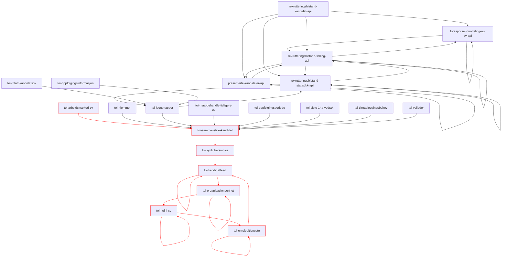
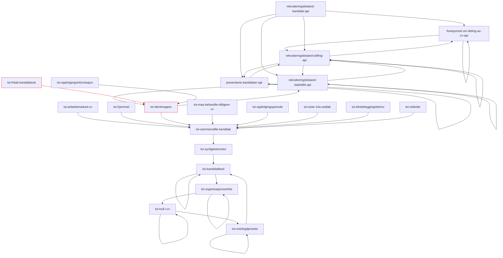
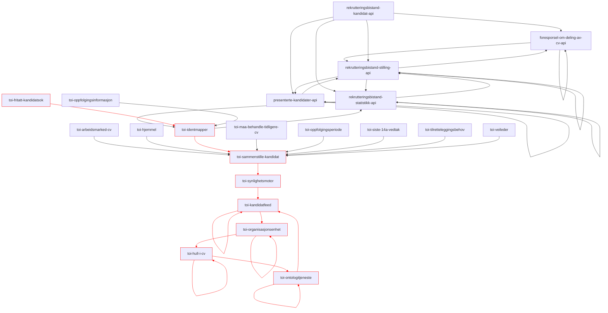
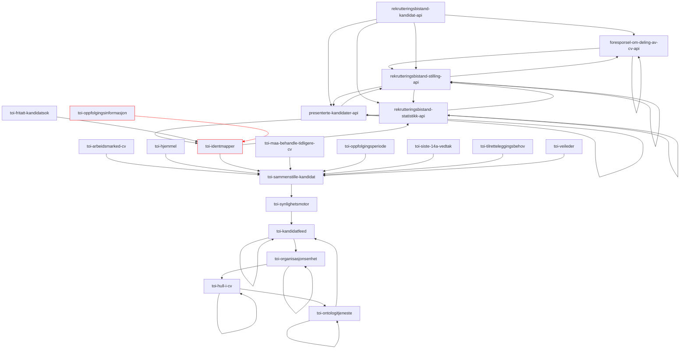
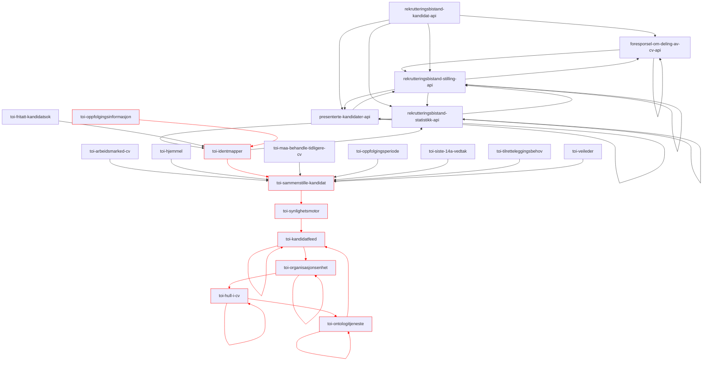
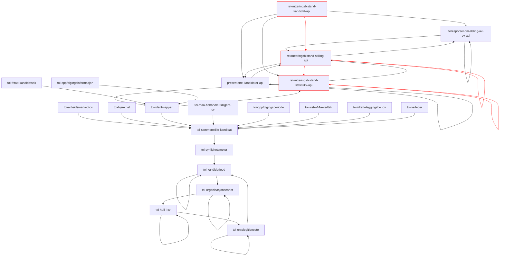
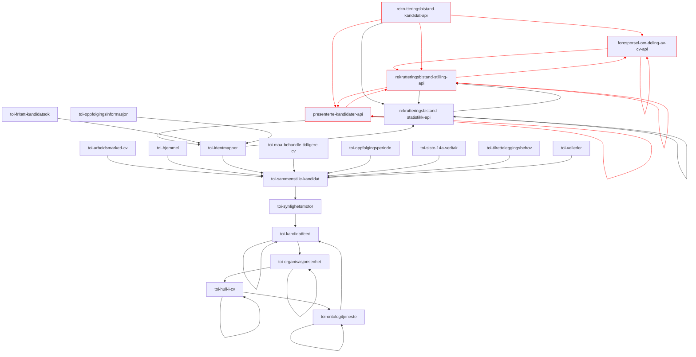
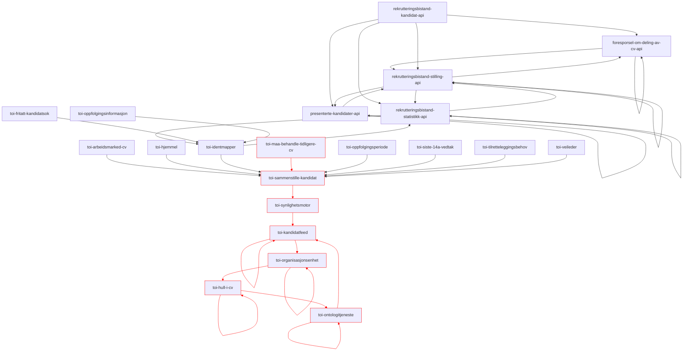
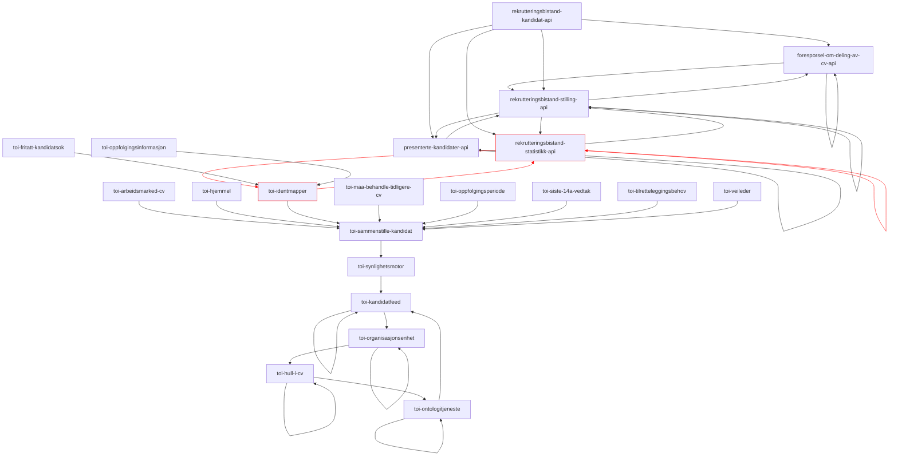
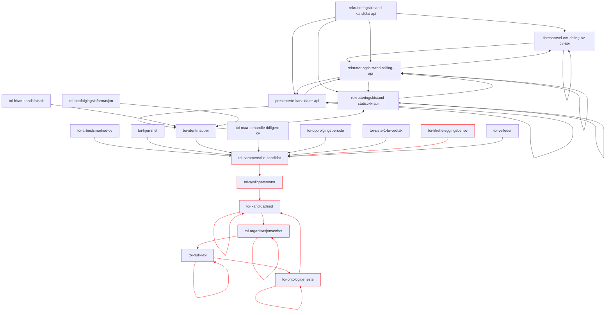

# Autogenerer graph for trafikken på toi-rapiden
Denne applikasjonen kjører hver midnatt og logger en mermaid-graph som viser hvordan applikasjonene på rapiden prater sammen:

Oppdatert 2023-03-24

arbeidsmarked-cv.sammenstilt

arbeidsmarked-cv

fritatt-kandidatsøk

fritatt-kandidatsøk.sammenstilt

oppfølgingsinformasjon

oppfølgingsinformasjon.sammenstilt

hjemmel

hjemmel.sammenstilt

veileder

veileder.sammenstilt

kandidat_v2.RegistrertFåttJobben

kandidat_v2.LukketKandidatliste

oppfølgingsperiode

oppfølgingsperiode.sammenstilt

må-behandle-tidligere-cv

må-behandle-tidligere-cv.sammenstilt

unknown event

tilretteleggingsbehov

tilretteleggingsbehov.sammenstilt

siste14avedtak
```mermaid
graph TD;
foresporsel-om-deling-av-cv-api --> foresporsel-om-deling-av-cv-api;
foresporsel-om-deling-av-cv-api --> rekrutteringsbistand-stilling-api;
presenterte-kandidater-api --> presenterte-kandidater-api;
presenterte-kandidater-api --> rekrutteringsbistand-stilling-api;
rekrutteringsbistand-kandidat-api --> foresporsel-om-deling-av-cv-api;
rekrutteringsbistand-kandidat-api --> presenterte-kandidater-api;
rekrutteringsbistand-kandidat-api --> rekrutteringsbistand-statistikk-api;
rekrutteringsbistand-kandidat-api --> rekrutteringsbistand-stilling-api;
rekrutteringsbistand-statistikk-api --> rekrutteringsbistand-statistikk-api;
rekrutteringsbistand-statistikk-api --> rekrutteringsbistand-stilling-api;
rekrutteringsbistand-statistikk-api --> toi-identmapper;
rekrutteringsbistand-stilling-api --> foresporsel-om-deling-av-cv-api;
rekrutteringsbistand-stilling-api --> presenterte-kandidater-api;
rekrutteringsbistand-stilling-api --> rekrutteringsbistand-statistikk-api;
rekrutteringsbistand-stilling-api --> rekrutteringsbistand-stilling-api;
toi-arbeidsmarked-cv --> toi-sammenstille-kandidat;
toi-fritatt-kandidatsok --> toi-identmapper;
toi-hjemmel --> toi-sammenstille-kandidat;
toi-hull-i-cv --> toi-hull-i-cv;
toi-hull-i-cv --> toi-ontologitjeneste;
toi-identmapper --> rekrutteringsbistand-statistikk-api;
toi-identmapper --> toi-sammenstille-kandidat;
toi-kandidatfeed --> toi-kandidatfeed;
toi-kandidatfeed --> toi-organisasjonsenhet;
toi-maa-behandle-tidligere-cv --> toi-sammenstille-kandidat;
toi-ontologitjeneste --> toi-kandidatfeed;
toi-ontologitjeneste --> toi-ontologitjeneste;
toi-oppfolgingsinformasjon --> toi-identmapper;
toi-oppfolgingsperiode --> toi-sammenstille-kandidat;
toi-organisasjonsenhet --> toi-hull-i-cv;
toi-organisasjonsenhet --> toi-organisasjonsenhet;
toi-sammenstille-kandidat --> toi-synlighetsmotor;
toi-siste-14a-vedtak --> toi-sammenstille-kandidat;
toi-synlighetsmotor --> toi-kandidatfeed;
toi-tilretteleggingsbehov --> toi-sammenstille-kandidat;
toi-veileder --> toi-sammenstille-kandidat;


```
siste14avedtak.sammenstilt
```mermaid
graph TD;
foresporsel-om-deling-av-cv-api --> foresporsel-om-deling-av-cv-api;
foresporsel-om-deling-av-cv-api --> rekrutteringsbistand-stilling-api;
presenterte-kandidater-api --> presenterte-kandidater-api;
presenterte-kandidater-api --> rekrutteringsbistand-stilling-api;
rekrutteringsbistand-kandidat-api --> foresporsel-om-deling-av-cv-api;
rekrutteringsbistand-kandidat-api --> presenterte-kandidater-api;
rekrutteringsbistand-kandidat-api --> rekrutteringsbistand-statistikk-api;
rekrutteringsbistand-kandidat-api --> rekrutteringsbistand-stilling-api;
rekrutteringsbistand-statistikk-api --> rekrutteringsbistand-statistikk-api;
rekrutteringsbistand-statistikk-api --> rekrutteringsbistand-stilling-api;
rekrutteringsbistand-statistikk-api --> toi-identmapper;
rekrutteringsbistand-stilling-api --> foresporsel-om-deling-av-cv-api;
rekrutteringsbistand-stilling-api --> presenterte-kandidater-api;
rekrutteringsbistand-stilling-api --> rekrutteringsbistand-statistikk-api;
rekrutteringsbistand-stilling-api --> rekrutteringsbistand-stilling-api;
toi-arbeidsmarked-cv --> toi-sammenstille-kandidat;
toi-fritatt-kandidatsok --> toi-identmapper;
toi-hjemmel --> toi-sammenstille-kandidat;
toi-hull-i-cv:::x --> toi-hull-i-cv:::x;
toi-hull-i-cv:::x --> toi-ontologitjeneste:::x;
toi-identmapper --> rekrutteringsbistand-statistikk-api;
toi-identmapper --> toi-sammenstille-kandidat;
toi-kandidatfeed:::x --> toi-kandidatfeed:::x;
toi-kandidatfeed:::x --> toi-organisasjonsenhet:::x;
toi-maa-behandle-tidligere-cv --> toi-sammenstille-kandidat;
toi-ontologitjeneste:::x --> toi-kandidatfeed:::x;
toi-ontologitjeneste:::x --> toi-ontologitjeneste:::x;
toi-oppfolgingsinformasjon --> toi-identmapper;
toi-oppfolgingsperiode --> toi-sammenstille-kandidat;
toi-organisasjonsenhet:::x --> toi-hull-i-cv:::x;
toi-organisasjonsenhet:::x --> toi-organisasjonsenhet:::x;
toi-sammenstille-kandidat:::x --> toi-synlighetsmotor:::x;
toi-siste-14a-vedtak:::x --> toi-sammenstille-kandidat:::x;
toi-synlighetsmotor:::x --> toi-kandidatfeed:::x;
toi-tilretteleggingsbehov --> toi-sammenstille-kandidat;
toi-veileder --> toi-sammenstille-kandidat;

linkStyle 18,19,22,23,25,26,29,30,31,32,33 stroke:red;
classDef x stroke: red;
```
kandidat_v2.OppdaterteKandidatliste
```mermaid
graph TD;
foresporsel-om-deling-av-cv-api --> foresporsel-om-deling-av-cv-api;
foresporsel-om-deling-av-cv-api --> rekrutteringsbistand-stilling-api;
presenterte-kandidater-api --> presenterte-kandidater-api;
presenterte-kandidater-api --> rekrutteringsbistand-stilling-api;
rekrutteringsbistand-kandidat-api --> foresporsel-om-deling-av-cv-api;
rekrutteringsbistand-kandidat-api --> presenterte-kandidater-api;
rekrutteringsbistand-kandidat-api --> rekrutteringsbistand-statistikk-api;
rekrutteringsbistand-kandidat-api:::x --> rekrutteringsbistand-stilling-api:::x;
rekrutteringsbistand-statistikk-api:::x --> rekrutteringsbistand-statistikk-api:::x;
rekrutteringsbistand-statistikk-api --> rekrutteringsbistand-stilling-api;
rekrutteringsbistand-statistikk-api --> toi-identmapper;
rekrutteringsbistand-stilling-api --> foresporsel-om-deling-av-cv-api;
rekrutteringsbistand-stilling-api --> presenterte-kandidater-api;
rekrutteringsbistand-stilling-api:::x --> rekrutteringsbistand-statistikk-api:::x;
rekrutteringsbistand-stilling-api:::x --> rekrutteringsbistand-stilling-api:::x;
toi-arbeidsmarked-cv --> toi-sammenstille-kandidat;
toi-fritatt-kandidatsok --> toi-identmapper;
toi-hjemmel --> toi-sammenstille-kandidat;
toi-hull-i-cv --> toi-hull-i-cv;
toi-hull-i-cv --> toi-ontologitjeneste;
toi-identmapper --> rekrutteringsbistand-statistikk-api;
toi-identmapper --> toi-sammenstille-kandidat;
toi-kandidatfeed --> toi-kandidatfeed;
toi-kandidatfeed --> toi-organisasjonsenhet;
toi-maa-behandle-tidligere-cv --> toi-sammenstille-kandidat;
toi-ontologitjeneste --> toi-kandidatfeed;
toi-ontologitjeneste --> toi-ontologitjeneste;
toi-oppfolgingsinformasjon --> toi-identmapper;
toi-oppfolgingsperiode --> toi-sammenstille-kandidat;
toi-organisasjonsenhet --> toi-hull-i-cv;
toi-organisasjonsenhet --> toi-organisasjonsenhet;
toi-sammenstille-kandidat --> toi-synlighetsmotor;
toi-siste-14a-vedtak --> toi-sammenstille-kandidat;
toi-synlighetsmotor --> toi-kandidatfeed;
toi-tilretteleggingsbehov --> toi-sammenstille-kandidat;
toi-veileder --> toi-sammenstille-kandidat;

linkStyle 7,8,13,14 stroke:red;
classDef x stroke: red;
```
arbeidsgiversKandidatliste.VisningKontaktinfo
```mermaid
graph TD;
foresporsel-om-deling-av-cv-api --> foresporsel-om-deling-av-cv-api;
foresporsel-om-deling-av-cv-api --> rekrutteringsbistand-stilling-api;
presenterte-kandidater-api --> presenterte-kandidater-api;
presenterte-kandidater-api --> rekrutteringsbistand-stilling-api;
rekrutteringsbistand-kandidat-api --> foresporsel-om-deling-av-cv-api;
rekrutteringsbistand-kandidat-api --> presenterte-kandidater-api;
rekrutteringsbistand-kandidat-api --> rekrutteringsbistand-statistikk-api;
rekrutteringsbistand-kandidat-api --> rekrutteringsbistand-stilling-api;
rekrutteringsbistand-statistikk-api:::x --> rekrutteringsbistand-statistikk-api:::x;
rekrutteringsbistand-statistikk-api --> rekrutteringsbistand-stilling-api;
rekrutteringsbistand-statistikk-api --> toi-identmapper;
rekrutteringsbistand-stilling-api --> foresporsel-om-deling-av-cv-api;
rekrutteringsbistand-stilling-api --> presenterte-kandidater-api;
rekrutteringsbistand-stilling-api --> rekrutteringsbistand-statistikk-api;
rekrutteringsbistand-stilling-api --> rekrutteringsbistand-stilling-api;
toi-arbeidsmarked-cv --> toi-sammenstille-kandidat;
toi-fritatt-kandidatsok --> toi-identmapper;
toi-hjemmel --> toi-sammenstille-kandidat;
toi-hull-i-cv --> toi-hull-i-cv;
toi-hull-i-cv --> toi-ontologitjeneste;
toi-identmapper --> rekrutteringsbistand-statistikk-api;
toi-identmapper --> toi-sammenstille-kandidat;
toi-kandidatfeed --> toi-kandidatfeed;
toi-kandidatfeed --> toi-organisasjonsenhet;
toi-maa-behandle-tidligere-cv --> toi-sammenstille-kandidat;
toi-ontologitjeneste --> toi-kandidatfeed;
toi-ontologitjeneste --> toi-ontologitjeneste;
toi-oppfolgingsinformasjon --> toi-identmapper;
toi-oppfolgingsperiode --> toi-sammenstille-kandidat;
toi-organisasjonsenhet --> toi-hull-i-cv;
toi-organisasjonsenhet --> toi-organisasjonsenhet;
toi-sammenstille-kandidat --> toi-synlighetsmotor;
toi-siste-14a-vedtak --> toi-sammenstille-kandidat;
toi-synlighetsmotor --> toi-kandidatfeed;
toi-tilretteleggingsbehov --> toi-sammenstille-kandidat;
toi-veileder --> toi-sammenstille-kandidat;

linkStyle 8 stroke:red;
classDef x stroke: red;
```
kandidat_v2.DelCvMedArbeidsgiver
```mermaid
graph TD;
foresporsel-om-deling-av-cv-api:::x --> foresporsel-om-deling-av-cv-api:::x;
foresporsel-om-deling-av-cv-api:::x --> rekrutteringsbistand-stilling-api:::x;
presenterte-kandidater-api --> presenterte-kandidater-api;
presenterte-kandidater-api --> rekrutteringsbistand-stilling-api;
rekrutteringsbistand-kandidat-api:::x --> foresporsel-om-deling-av-cv-api:::x;
rekrutteringsbistand-kandidat-api --> presenterte-kandidater-api;
rekrutteringsbistand-kandidat-api:::x --> rekrutteringsbistand-statistikk-api:::x;
rekrutteringsbistand-kandidat-api:::x --> rekrutteringsbistand-stilling-api:::x;
rekrutteringsbistand-statistikk-api:::x --> rekrutteringsbistand-statistikk-api:::x;
rekrutteringsbistand-statistikk-api:::x --> rekrutteringsbistand-stilling-api:::x;
rekrutteringsbistand-statistikk-api --> toi-identmapper;
rekrutteringsbistand-stilling-api:::x --> foresporsel-om-deling-av-cv-api:::x;
rekrutteringsbistand-stilling-api --> presenterte-kandidater-api;
rekrutteringsbistand-stilling-api:::x --> rekrutteringsbistand-statistikk-api:::x;
rekrutteringsbistand-stilling-api:::x --> rekrutteringsbistand-stilling-api:::x;
toi-arbeidsmarked-cv --> toi-sammenstille-kandidat;
toi-fritatt-kandidatsok --> toi-identmapper;
toi-hjemmel --> toi-sammenstille-kandidat;
toi-hull-i-cv --> toi-hull-i-cv;
toi-hull-i-cv --> toi-ontologitjeneste;
toi-identmapper --> rekrutteringsbistand-statistikk-api;
toi-identmapper --> toi-sammenstille-kandidat;
toi-kandidatfeed --> toi-kandidatfeed;
toi-kandidatfeed --> toi-organisasjonsenhet;
toi-maa-behandle-tidligere-cv --> toi-sammenstille-kandidat;
toi-ontologitjeneste --> toi-kandidatfeed;
toi-ontologitjeneste --> toi-ontologitjeneste;
toi-oppfolgingsinformasjon --> toi-identmapper;
toi-oppfolgingsperiode --> toi-sammenstille-kandidat;
toi-organisasjonsenhet --> toi-hull-i-cv;
toi-organisasjonsenhet --> toi-organisasjonsenhet;
toi-sammenstille-kandidat --> toi-synlighetsmotor;
toi-siste-14a-vedtak --> toi-sammenstille-kandidat;
toi-synlighetsmotor --> toi-kandidatfeed;
toi-tilretteleggingsbehov --> toi-sammenstille-kandidat;
toi-veileder --> toi-sammenstille-kandidat;

linkStyle 0,1,4,6,7,8,9,11,13,14 stroke:red;
classDef x stroke: red;
```
notifikasjon.cv-delt
```mermaid
graph TD;
foresporsel-om-deling-av-cv-api --> foresporsel-om-deling-av-cv-api;
foresporsel-om-deling-av-cv-api --> rekrutteringsbistand-stilling-api;
presenterte-kandidater-api --> presenterte-kandidater-api;
presenterte-kandidater-api --> rekrutteringsbistand-stilling-api;
rekrutteringsbistand-kandidat-api --> foresporsel-om-deling-av-cv-api;
rekrutteringsbistand-kandidat-api --> presenterte-kandidater-api;
rekrutteringsbistand-kandidat-api --> rekrutteringsbistand-statistikk-api;
rekrutteringsbistand-kandidat-api --> rekrutteringsbistand-stilling-api;
rekrutteringsbistand-statistikk-api --> rekrutteringsbistand-statistikk-api;
rekrutteringsbistand-statistikk-api --> rekrutteringsbistand-stilling-api;
rekrutteringsbistand-statistikk-api --> toi-identmapper;
rekrutteringsbistand-stilling-api --> foresporsel-om-deling-av-cv-api;
rekrutteringsbistand-stilling-api --> presenterte-kandidater-api;
rekrutteringsbistand-stilling-api --> rekrutteringsbistand-statistikk-api;
rekrutteringsbistand-stilling-api:::x --> rekrutteringsbistand-stilling-api:::x;
toi-arbeidsmarked-cv --> toi-sammenstille-kandidat;
toi-fritatt-kandidatsok --> toi-identmapper;
toi-hjemmel --> toi-sammenstille-kandidat;
toi-hull-i-cv --> toi-hull-i-cv;
toi-hull-i-cv --> toi-ontologitjeneste;
toi-identmapper --> rekrutteringsbistand-statistikk-api;
toi-identmapper --> toi-sammenstille-kandidat;
toi-kandidatfeed --> toi-kandidatfeed;
toi-kandidatfeed --> toi-organisasjonsenhet;
toi-maa-behandle-tidligere-cv --> toi-sammenstille-kandidat;
toi-ontologitjeneste --> toi-kandidatfeed;
toi-ontologitjeneste --> toi-ontologitjeneste;
toi-oppfolgingsinformasjon --> toi-identmapper;
toi-oppfolgingsperiode --> toi-sammenstille-kandidat;
toi-organisasjonsenhet --> toi-hull-i-cv;
toi-organisasjonsenhet --> toi-organisasjonsenhet;
toi-sammenstille-kandidat --> toi-synlighetsmotor;
toi-siste-14a-vedtak --> toi-sammenstille-kandidat;
toi-synlighetsmotor --> toi-kandidatfeed;
toi-tilretteleggingsbehov --> toi-sammenstille-kandidat;
toi-veileder --> toi-sammenstille-kandidat;

linkStyle 14 stroke:red;
classDef x stroke: red;
```
kandidat_v2.OpprettetKandidatliste
```mermaid
graph TD;
foresporsel-om-deling-av-cv-api --> foresporsel-om-deling-av-cv-api;
foresporsel-om-deling-av-cv-api --> rekrutteringsbistand-stilling-api;
presenterte-kandidater-api --> presenterte-kandidater-api;
presenterte-kandidater-api --> rekrutteringsbistand-stilling-api;
rekrutteringsbistand-kandidat-api --> foresporsel-om-deling-av-cv-api;
rekrutteringsbistand-kandidat-api --> presenterte-kandidater-api;
rekrutteringsbistand-kandidat-api --> rekrutteringsbistand-statistikk-api;
rekrutteringsbistand-kandidat-api:::x --> rekrutteringsbistand-stilling-api:::x;
rekrutteringsbistand-statistikk-api:::x --> rekrutteringsbistand-statistikk-api:::x;
rekrutteringsbistand-statistikk-api --> rekrutteringsbistand-stilling-api;
rekrutteringsbistand-statistikk-api --> toi-identmapper;
rekrutteringsbistand-stilling-api --> foresporsel-om-deling-av-cv-api;
rekrutteringsbistand-stilling-api --> presenterte-kandidater-api;
rekrutteringsbistand-stilling-api:::x --> rekrutteringsbistand-statistikk-api:::x;
rekrutteringsbistand-stilling-api:::x --> rekrutteringsbistand-stilling-api:::x;
toi-arbeidsmarked-cv --> toi-sammenstille-kandidat;
toi-fritatt-kandidatsok --> toi-identmapper;
toi-hjemmel --> toi-sammenstille-kandidat;
toi-hull-i-cv --> toi-hull-i-cv;
toi-hull-i-cv --> toi-ontologitjeneste;
toi-identmapper --> rekrutteringsbistand-statistikk-api;
toi-identmapper --> toi-sammenstille-kandidat;
toi-kandidatfeed --> toi-kandidatfeed;
toi-kandidatfeed --> toi-organisasjonsenhet;
toi-maa-behandle-tidligere-cv --> toi-sammenstille-kandidat;
toi-ontologitjeneste --> toi-kandidatfeed;
toi-ontologitjeneste --> toi-ontologitjeneste;
toi-oppfolgingsinformasjon --> toi-identmapper;
toi-oppfolgingsperiode --> toi-sammenstille-kandidat;
toi-organisasjonsenhet --> toi-hull-i-cv;
toi-organisasjonsenhet --> toi-organisasjonsenhet;
toi-sammenstille-kandidat --> toi-synlighetsmotor;
toi-siste-14a-vedtak --> toi-sammenstille-kandidat;
toi-synlighetsmotor --> toi-kandidatfeed;
toi-tilretteleggingsbehov --> toi-sammenstille-kandidat;
toi-veileder --> toi-sammenstille-kandidat;

linkStyle 7,8,13,14 stroke:red;
classDef x stroke: red;
```
kandidat_v2.RegistrertDeltCv
```mermaid
graph TD;
foresporsel-om-deling-av-cv-api --> foresporsel-om-deling-av-cv-api;
foresporsel-om-deling-av-cv-api --> rekrutteringsbistand-stilling-api;
presenterte-kandidater-api --> presenterte-kandidater-api;
presenterte-kandidater-api --> rekrutteringsbistand-stilling-api;
rekrutteringsbistand-kandidat-api --> foresporsel-om-deling-av-cv-api;
rekrutteringsbistand-kandidat-api --> presenterte-kandidater-api;
rekrutteringsbistand-kandidat-api --> rekrutteringsbistand-statistikk-api;
rekrutteringsbistand-kandidat-api:::x --> rekrutteringsbistand-stilling-api:::x;
rekrutteringsbistand-statistikk-api:::x --> rekrutteringsbistand-statistikk-api:::x;
rekrutteringsbistand-statistikk-api --> rekrutteringsbistand-stilling-api;
rekrutteringsbistand-statistikk-api --> toi-identmapper;
rekrutteringsbistand-stilling-api --> foresporsel-om-deling-av-cv-api;
rekrutteringsbistand-stilling-api --> presenterte-kandidater-api;
rekrutteringsbistand-stilling-api:::x --> rekrutteringsbistand-statistikk-api:::x;
rekrutteringsbistand-stilling-api:::x --> rekrutteringsbistand-stilling-api:::x;
toi-arbeidsmarked-cv --> toi-sammenstille-kandidat;
toi-fritatt-kandidatsok --> toi-identmapper;
toi-hjemmel --> toi-sammenstille-kandidat;
toi-hull-i-cv --> toi-hull-i-cv;
toi-hull-i-cv --> toi-ontologitjeneste;
toi-identmapper --> rekrutteringsbistand-statistikk-api;
toi-identmapper --> toi-sammenstille-kandidat;
toi-kandidatfeed --> toi-kandidatfeed;
toi-kandidatfeed --> toi-organisasjonsenhet;
toi-maa-behandle-tidligere-cv --> toi-sammenstille-kandidat;
toi-ontologitjeneste --> toi-kandidatfeed;
toi-ontologitjeneste --> toi-ontologitjeneste;
toi-oppfolgingsinformasjon --> toi-identmapper;
toi-oppfolgingsperiode --> toi-sammenstille-kandidat;
toi-organisasjonsenhet --> toi-hull-i-cv;
toi-organisasjonsenhet --> toi-organisasjonsenhet;
toi-sammenstille-kandidat --> toi-synlighetsmotor;
toi-siste-14a-vedtak --> toi-sammenstille-kandidat;
toi-synlighetsmotor --> toi-kandidatfeed;
toi-tilretteleggingsbehov --> toi-sammenstille-kandidat;
toi-veileder --> toi-sammenstille-kandidat;

linkStyle 7,8,13,14 stroke:red;
classDef x stroke: red;
```
kandidat_v2.SlettFraArbeidsgiversKandidatliste
```mermaid
graph TD;
foresporsel-om-deling-av-cv-api --> foresporsel-om-deling-av-cv-api;
foresporsel-om-deling-av-cv-api --> rekrutteringsbistand-stilling-api;
presenterte-kandidater-api:::x --> presenterte-kandidater-api:::x;
presenterte-kandidater-api:::x --> rekrutteringsbistand-stilling-api:::x;
rekrutteringsbistand-kandidat-api --> foresporsel-om-deling-av-cv-api;
rekrutteringsbistand-kandidat-api:::x --> presenterte-kandidater-api:::x;
rekrutteringsbistand-kandidat-api --> rekrutteringsbistand-statistikk-api;
rekrutteringsbistand-kandidat-api:::x --> rekrutteringsbistand-stilling-api:::x;
rekrutteringsbistand-statistikk-api --> rekrutteringsbistand-statistikk-api;
rekrutteringsbistand-statistikk-api --> rekrutteringsbistand-stilling-api;
rekrutteringsbistand-statistikk-api --> toi-identmapper;
rekrutteringsbistand-stilling-api --> foresporsel-om-deling-av-cv-api;
rekrutteringsbistand-stilling-api:::x --> presenterte-kandidater-api:::x;
rekrutteringsbistand-stilling-api --> rekrutteringsbistand-statistikk-api;
rekrutteringsbistand-stilling-api:::x --> rekrutteringsbistand-stilling-api:::x;
toi-arbeidsmarked-cv --> toi-sammenstille-kandidat;
toi-fritatt-kandidatsok --> toi-identmapper;
toi-hjemmel --> toi-sammenstille-kandidat;
toi-hull-i-cv --> toi-hull-i-cv;
toi-hull-i-cv --> toi-ontologitjeneste;
toi-identmapper --> rekrutteringsbistand-statistikk-api;
toi-identmapper --> toi-sammenstille-kandidat;
toi-kandidatfeed --> toi-kandidatfeed;
toi-kandidatfeed --> toi-organisasjonsenhet;
toi-maa-behandle-tidligere-cv --> toi-sammenstille-kandidat;
toi-ontologitjeneste --> toi-kandidatfeed;
toi-ontologitjeneste --> toi-ontologitjeneste;
toi-oppfolgingsinformasjon --> toi-identmapper;
toi-oppfolgingsperiode --> toi-sammenstille-kandidat;
toi-organisasjonsenhet --> toi-hull-i-cv;
toi-organisasjonsenhet --> toi-organisasjonsenhet;
toi-sammenstille-kandidat --> toi-synlighetsmotor;
toi-siste-14a-vedtak --> toi-sammenstille-kandidat;
toi-synlighetsmotor --> toi-kandidatfeed;
toi-tilretteleggingsbehov --> toi-sammenstille-kandidat;
toi-veileder --> toi-sammenstille-kandidat;

linkStyle 2,3,5,7,12,14 stroke:red;
classDef x stroke: red;
```
kandidat_v2.SlettetStillingOgKandidatliste
```mermaid
graph TD;
foresporsel-om-deling-av-cv-api --> foresporsel-om-deling-av-cv-api;
foresporsel-om-deling-av-cv-api --> rekrutteringsbistand-stilling-api;
presenterte-kandidater-api:::x --> presenterte-kandidater-api:::x;
presenterte-kandidater-api:::x --> rekrutteringsbistand-stilling-api:::x;
rekrutteringsbistand-kandidat-api --> foresporsel-om-deling-av-cv-api;
rekrutteringsbistand-kandidat-api:::x --> presenterte-kandidater-api:::x;
rekrutteringsbistand-kandidat-api --> rekrutteringsbistand-statistikk-api;
rekrutteringsbistand-kandidat-api:::x --> rekrutteringsbistand-stilling-api:::x;
rekrutteringsbistand-statistikk-api:::x --> rekrutteringsbistand-statistikk-api:::x;
rekrutteringsbistand-statistikk-api --> rekrutteringsbistand-stilling-api;
rekrutteringsbistand-statistikk-api --> toi-identmapper;
rekrutteringsbistand-stilling-api --> foresporsel-om-deling-av-cv-api;
rekrutteringsbistand-stilling-api:::x --> presenterte-kandidater-api:::x;
rekrutteringsbistand-stilling-api:::x --> rekrutteringsbistand-statistikk-api:::x;
rekrutteringsbistand-stilling-api:::x --> rekrutteringsbistand-stilling-api:::x;
toi-arbeidsmarked-cv --> toi-sammenstille-kandidat;
toi-fritatt-kandidatsok --> toi-identmapper;
toi-hjemmel --> toi-sammenstille-kandidat;
toi-hull-i-cv --> toi-hull-i-cv;
toi-hull-i-cv --> toi-ontologitjeneste;
toi-identmapper --> rekrutteringsbistand-statistikk-api;
toi-identmapper --> toi-sammenstille-kandidat;
toi-kandidatfeed --> toi-kandidatfeed;
toi-kandidatfeed --> toi-organisasjonsenhet;
toi-maa-behandle-tidligere-cv --> toi-sammenstille-kandidat;
toi-ontologitjeneste --> toi-kandidatfeed;
toi-ontologitjeneste --> toi-ontologitjeneste;
toi-oppfolgingsinformasjon --> toi-identmapper;
toi-oppfolgingsperiode --> toi-sammenstille-kandidat;
toi-organisasjonsenhet --> toi-hull-i-cv;
toi-organisasjonsenhet --> toi-organisasjonsenhet;
toi-sammenstille-kandidat --> toi-synlighetsmotor;
toi-siste-14a-vedtak --> toi-sammenstille-kandidat;
toi-synlighetsmotor --> toi-kandidatfeed;
toi-tilretteleggingsbehov --> toi-sammenstille-kandidat;
toi-veileder --> toi-sammenstille-kandidat;

linkStyle 2,3,5,7,8,12,13,14 stroke:red;
classDef x stroke: red;
```
kandidat_v2.FjernetRegistreringFåttJobben
```mermaid
graph TD;
foresporsel-om-deling-av-cv-api --> foresporsel-om-deling-av-cv-api;
foresporsel-om-deling-av-cv-api --> rekrutteringsbistand-stilling-api;
presenterte-kandidater-api --> presenterte-kandidater-api;
presenterte-kandidater-api --> rekrutteringsbistand-stilling-api;
rekrutteringsbistand-kandidat-api --> foresporsel-om-deling-av-cv-api;
rekrutteringsbistand-kandidat-api --> presenterte-kandidater-api;
rekrutteringsbistand-kandidat-api --> rekrutteringsbistand-statistikk-api;
rekrutteringsbistand-kandidat-api:::x --> rekrutteringsbistand-stilling-api:::x;
rekrutteringsbistand-statistikk-api:::x --> rekrutteringsbistand-statistikk-api:::x;
rekrutteringsbistand-statistikk-api --> rekrutteringsbistand-stilling-api;
rekrutteringsbistand-statistikk-api --> toi-identmapper;
rekrutteringsbistand-stilling-api --> foresporsel-om-deling-av-cv-api;
rekrutteringsbistand-stilling-api --> presenterte-kandidater-api;
rekrutteringsbistand-stilling-api:::x --> rekrutteringsbistand-statistikk-api:::x;
rekrutteringsbistand-stilling-api:::x --> rekrutteringsbistand-stilling-api:::x;
toi-arbeidsmarked-cv --> toi-sammenstille-kandidat;
toi-fritatt-kandidatsok --> toi-identmapper;
toi-hjemmel --> toi-sammenstille-kandidat;
toi-hull-i-cv --> toi-hull-i-cv;
toi-hull-i-cv --> toi-ontologitjeneste;
toi-identmapper --> rekrutteringsbistand-statistikk-api;
toi-identmapper --> toi-sammenstille-kandidat;
toi-kandidatfeed --> toi-kandidatfeed;
toi-kandidatfeed --> toi-organisasjonsenhet;
toi-maa-behandle-tidligere-cv --> toi-sammenstille-kandidat;
toi-ontologitjeneste --> toi-kandidatfeed;
toi-ontologitjeneste --> toi-ontologitjeneste;
toi-oppfolgingsinformasjon --> toi-identmapper;
toi-oppfolgingsperiode --> toi-sammenstille-kandidat;
toi-organisasjonsenhet --> toi-hull-i-cv;
toi-organisasjonsenhet --> toi-organisasjonsenhet;
toi-sammenstille-kandidat --> toi-synlighetsmotor;
toi-siste-14a-vedtak --> toi-sammenstille-kandidat;
toi-synlighetsmotor --> toi-kandidatfeed;
toi-tilretteleggingsbehov --> toi-sammenstille-kandidat;
toi-veileder --> toi-sammenstille-kandidat;

linkStyle 7,8,13,14 stroke:red;
classDef x stroke: red;
```
kandidat_v2.FjernetRegistreringDeltCv
```mermaid
graph TD;
foresporsel-om-deling-av-cv-api --> foresporsel-om-deling-av-cv-api;
foresporsel-om-deling-av-cv-api --> rekrutteringsbistand-stilling-api;
presenterte-kandidater-api --> presenterte-kandidater-api;
presenterte-kandidater-api --> rekrutteringsbistand-stilling-api;
rekrutteringsbistand-kandidat-api --> foresporsel-om-deling-av-cv-api;
rekrutteringsbistand-kandidat-api --> presenterte-kandidater-api;
rekrutteringsbistand-kandidat-api --> rekrutteringsbistand-statistikk-api;
rekrutteringsbistand-kandidat-api:::x --> rekrutteringsbistand-stilling-api:::x;
rekrutteringsbistand-statistikk-api:::x --> rekrutteringsbistand-statistikk-api:::x;
rekrutteringsbistand-statistikk-api --> rekrutteringsbistand-stilling-api;
rekrutteringsbistand-statistikk-api --> toi-identmapper;
rekrutteringsbistand-stilling-api --> foresporsel-om-deling-av-cv-api;
rekrutteringsbistand-stilling-api --> presenterte-kandidater-api;
rekrutteringsbistand-stilling-api:::x --> rekrutteringsbistand-statistikk-api:::x;
rekrutteringsbistand-stilling-api:::x --> rekrutteringsbistand-stilling-api:::x;
toi-arbeidsmarked-cv --> toi-sammenstille-kandidat;
toi-fritatt-kandidatsok --> toi-identmapper;
toi-hjemmel --> toi-sammenstille-kandidat;
toi-hull-i-cv --> toi-hull-i-cv;
toi-hull-i-cv --> toi-ontologitjeneste;
toi-identmapper --> rekrutteringsbistand-statistikk-api;
toi-identmapper --> toi-sammenstille-kandidat;
toi-kandidatfeed --> toi-kandidatfeed;
toi-kandidatfeed --> toi-organisasjonsenhet;
toi-maa-behandle-tidligere-cv --> toi-sammenstille-kandidat;
toi-ontologitjeneste --> toi-kandidatfeed;
toi-ontologitjeneste --> toi-ontologitjeneste;
toi-oppfolgingsinformasjon --> toi-identmapper;
toi-oppfolgingsperiode --> toi-sammenstille-kandidat;
toi-organisasjonsenhet --> toi-hull-i-cv;
toi-organisasjonsenhet --> toi-organisasjonsenhet;
toi-sammenstille-kandidat --> toi-synlighetsmotor;
toi-siste-14a-vedtak --> toi-sammenstille-kandidat;
toi-synlighetsmotor --> toi-kandidatfeed;
toi-tilretteleggingsbehov --> toi-sammenstille-kandidat;
toi-veileder --> toi-sammenstille-kandidat;

linkStyle 7,8,13,14 stroke:red;
classDef x stroke: red;
```
republisert.sammenstilt
```mermaid
graph TD;
foresporsel-om-deling-av-cv-api --> foresporsel-om-deling-av-cv-api;
foresporsel-om-deling-av-cv-api --> rekrutteringsbistand-stilling-api;
presenterte-kandidater-api --> presenterte-kandidater-api;
presenterte-kandidater-api --> rekrutteringsbistand-stilling-api;
rekrutteringsbistand-kandidat-api --> foresporsel-om-deling-av-cv-api;
rekrutteringsbistand-kandidat-api --> presenterte-kandidater-api;
rekrutteringsbistand-kandidat-api --> rekrutteringsbistand-statistikk-api;
rekrutteringsbistand-kandidat-api --> rekrutteringsbistand-stilling-api;
rekrutteringsbistand-statistikk-api --> rekrutteringsbistand-statistikk-api;
rekrutteringsbistand-statistikk-api --> rekrutteringsbistand-stilling-api;
rekrutteringsbistand-statistikk-api --> toi-identmapper;
rekrutteringsbistand-stilling-api --> foresporsel-om-deling-av-cv-api;
rekrutteringsbistand-stilling-api --> presenterte-kandidater-api;
rekrutteringsbistand-stilling-api --> rekrutteringsbistand-statistikk-api;
rekrutteringsbistand-stilling-api --> rekrutteringsbistand-stilling-api;
toi-arbeidsmarked-cv --> toi-sammenstille-kandidat;
toi-fritatt-kandidatsok --> toi-identmapper;
toi-hjemmel --> toi-sammenstille-kandidat;
toi-hull-i-cv:::x --> toi-hull-i-cv:::x;
toi-hull-i-cv:::x --> toi-ontologitjeneste:::x;
toi-identmapper --> rekrutteringsbistand-statistikk-api;
toi-identmapper --> toi-sammenstille-kandidat;
toi-kandidatfeed:::x --> toi-kandidatfeed:::x;
toi-kandidatfeed:::x --> toi-organisasjonsenhet:::x;
toi-maa-behandle-tidligere-cv --> toi-sammenstille-kandidat;
toi-ontologitjeneste:::x --> toi-kandidatfeed:::x;
toi-ontologitjeneste:::x --> toi-ontologitjeneste:::x;
toi-oppfolgingsinformasjon --> toi-identmapper;
toi-oppfolgingsperiode --> toi-sammenstille-kandidat;
toi-organisasjonsenhet:::x --> toi-hull-i-cv:::x;
toi-organisasjonsenhet:::x --> toi-organisasjonsenhet:::x;
toi-sammenstille-kandidat:::x --> toi-synlighetsmotor:::x;
toi-siste-14a-vedtak --> toi-sammenstille-kandidat;
toi-synlighetsmotor:::x --> toi-kandidatfeed:::x;
toi-tilretteleggingsbehov --> toi-sammenstille-kandidat;
toi-veileder --> toi-sammenstille-kandidat;

linkStyle 18,19,22,23,25,26,29,30,31,33 stroke:red;
classDef x stroke: red;
```
<details>
<summary>tiltakAvtaleIngått</summary>
```mermaid
graph TD;
foresporsel-om-deling-av-cv-api --> foresporsel-om-deling-av-cv-api;
foresporsel-om-deling-av-cv-api --> rekrutteringsbistand-stilling-api;
presenterte-kandidater-api --> presenterte-kandidater-api;
presenterte-kandidater-api --> rekrutteringsbistand-stilling-api;
rekrutteringsbistand-kandidat-api --> foresporsel-om-deling-av-cv-api;
rekrutteringsbistand-kandidat-api --> presenterte-kandidater-api;
rekrutteringsbistand-kandidat-api --> rekrutteringsbistand-statistikk-api;
rekrutteringsbistand-kandidat-api --> rekrutteringsbistand-stilling-api;
rekrutteringsbistand-statistikk-api:::x --> rekrutteringsbistand-statistikk-api:::x;
rekrutteringsbistand-statistikk-api --> rekrutteringsbistand-stilling-api;
rekrutteringsbistand-statistikk-api:::x --> toi-identmapper:::x;
rekrutteringsbistand-stilling-api --> foresporsel-om-deling-av-cv-api;
rekrutteringsbistand-stilling-api --> presenterte-kandidater-api;
rekrutteringsbistand-stilling-api --> rekrutteringsbistand-statistikk-api;
rekrutteringsbistand-stilling-api --> rekrutteringsbistand-stilling-api;
toi-arbeidsmarked-cv --> toi-sammenstille-kandidat;
toi-fritatt-kandidatsok --> toi-identmapper;
toi-hjemmel --> toi-sammenstille-kandidat;
toi-hull-i-cv --> toi-hull-i-cv;
toi-hull-i-cv --> toi-ontologitjeneste;
toi-identmapper:::x --> rekrutteringsbistand-statistikk-api:::x;
toi-identmapper --> toi-sammenstille-kandidat;
toi-kandidatfeed --> toi-kandidatfeed;
toi-kandidatfeed --> toi-organisasjonsenhet;
toi-maa-behandle-tidligere-cv --> toi-sammenstille-kandidat;
toi-ontologitjeneste --> toi-kandidatfeed;
toi-ontologitjeneste --> toi-ontologitjeneste;
toi-oppfolgingsinformasjon --> toi-identmapper;
toi-oppfolgingsperiode --> toi-sammenstille-kandidat;
toi-organisasjonsenhet --> toi-hull-i-cv;
toi-organisasjonsenhet --> toi-organisasjonsenhet;
toi-sammenstille-kandidat --> toi-synlighetsmotor;
toi-siste-14a-vedtak --> toi-sammenstille-kandidat;
toi-synlighetsmotor --> toi-kandidatfeed;
toi-tilretteleggingsbehov --> toi-sammenstille-kandidat;
toi-veileder --> toi-sammenstille-kandidat;

linkStyle 8,10,20 stroke:red;
classDef x stroke: red;
```
</details>


# Definisjoner 

## RapidService
En applikasjon som leser/skriver eventer på rapid

## Graph
Noder og kanter som viser en oversikt over eventer mellom applikasjoner

### Node
Node-representasjon av en rapid-service. 
#### Edge
Edge-representasjon av event som går  mellom to rapid-servicer
Brukes inne i node for å vise hva som er neste node den peker på.

## Event
Melding fra rapid

## MermaidGraph
Visualisering av mermaid-grafer basert på tekstedefinisjoner som kan tolkes i markup

### MermaidTextDefinition
En linje i MermaidGraph


